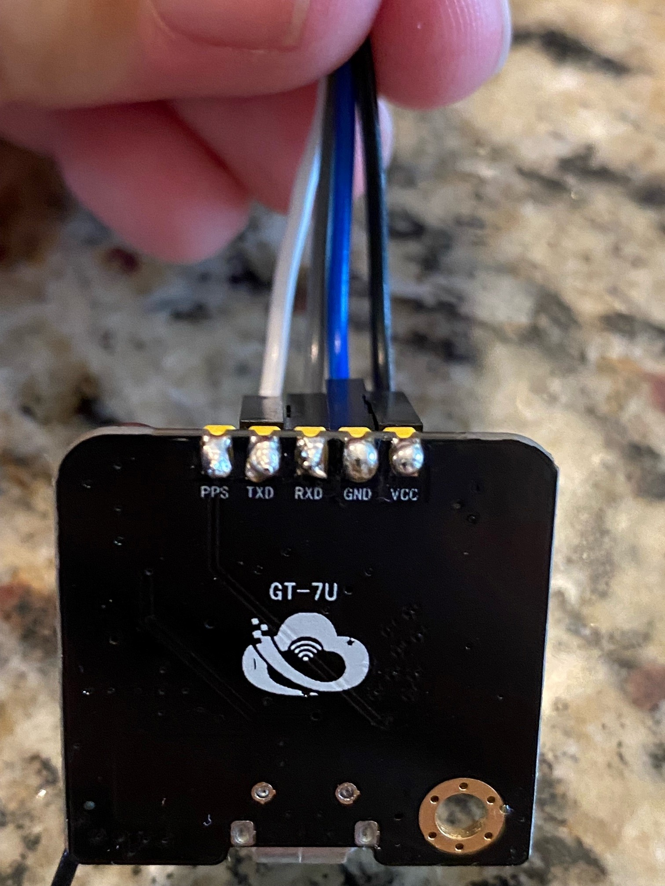
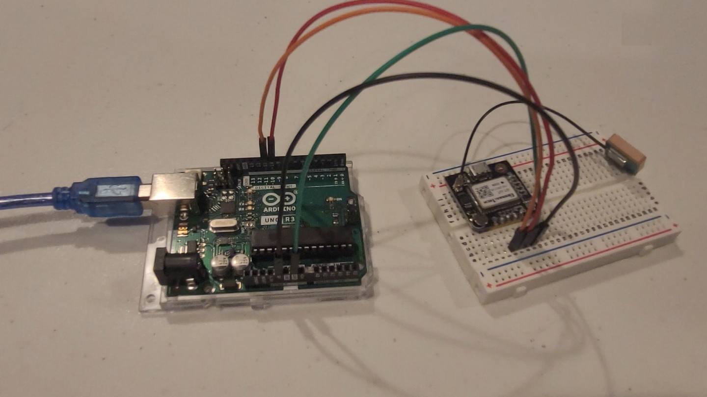

# Welcome to Lesson #4: GPS Sensor

## Working with GPS sensor data using the Arduino language

#### Pre-requisites:
- It is recommended that you have successfully completed the [blinky lights lesson](/c/arduino/lesson1/)
</br></br>

#### Objectives:
- Wire up the GPS to the Arduino
- Read GPS sensor data
- Print the GPS sensor data to the serial port
- Monitor data on the serial monitor in the Arduino IDE
</br></br>

#### What you will be using:
- [Arduino IDE](/c/arduino/lesson5/screenshots/arduino-ide.png)
- [Arduino Uno](/c/arduino/lesson5/screenshots/arduino-uno-r3.png)
- GPS GT-U7 Sensor<br>
- [5 pin connector](/c/arduino/lesson4/screenshots/5-pin-connector.png)
- [Breadboard](/c/arduino/lesson5/screenshots/breadboard.png)
- [Jumper Wires](/c/arduino/lesson3/screenshots/1956-02.jpg)
</br></br>

#### Note: I had some issues using the GPS module from inside my garage. If you do not get data on your serial monitor. Here are some things you can try to get good results...
</br>

## Tips
- Try working near a window with the best view of the sky
- Try taking your laptop outside along with the Arduino and all of its components that are connected
- It does take "some time" to acquire satalites. If it works where you like to work, then great
</br></br>

#### What you will be learning:
- How to connect the GPS GT-U7 to the Arduino
- How to create a new Arduino Sketch project using the TinyGPSPlus Library
- Write the code in the Arduino IDE and upload it to the Arduino
  - Read Latitude, Longitude, Altitude, speed, and the number of satellites you are connected to from the GPS module
  - Print your results to the Arduino's serial port
- Watch your code run on the Arduino using Arduino IDE's serial monitor
</br></br>

<!-- ## Guide
Click this link and watch this YouTube video [How to use the GT U7 GPS module](https://youtu.be/7zw2ULu73DY)
</br></br>

#### Helpful video shortcuts
- [Connect the GPS GT-U7 to the Arduino](https://youtu.be/7zw2ULu73DY?t=54)
</br></br> -->

### Video Walk-through
In addition to the reading below, you can watch this [video](videos/Lesson4.mp4?raw=true) for guidance!
<br><br>

#### Tips
- **Unplug the Arduino from the computer before doing this**
- Make sure everything is wired correctly, if you did not catch the wiring in the video, use the chart below. 
- The color of the wires do not matter as long as they are connected to the right pins
</br></br>

<!-- </br>
</br>
</br> -->

### Pinout chart

  **Pin on the GPS module** | **Pin on the Arduino**
  --------------- | --------------- 
  TXD   | Digital pin 11
  RXD   | Digital pin 10
  GND  | Any Ground pin 
  VDC   | 5 volts
</br>  

<!-- **You are welcome to use the bread board as well to wire everything up.** -->

  
#### How to get the TinyGPSPlus library:
- Install theTinyGPSPlus library through the Arduino IDE by going to Sketch -> Include Library -> Manage Libraries -> then search for "TinyGPSPlus"
<br><br>

## Steps
- Verify the TinyGPSPlus library is installed 
- Copy and paste this code into a sketch and run it
- In order to see the serial monitor, where your data will be printing out, press ctrl + shift + m or enter the tools menu and select the serial monitor
</br></br>

```java
#include "TinyGPSPlus.h"
#include <SoftwareSerial.h>

// Create the serial_connection
//
// Connect the GT-U7 RX and TX to the Arduino
// using the following connections...
// RX=pin --> Arduino analog 10
// TX pin --> Arduino analog 11
//
// In the code below on line 14 is the constructor.
// use the RX pin number as the first argument
// use the TX pin number as the second argument
SoftwareSerial serial_connection(10, 11);

TinyGPSPlus gps;

void setup() {
  // put your setup code here, to run once:
  Serial.begin(9600);
  serial_connection.begin(9600);
  Serial.println("GPS Start");
}

void loop() {
  // put your main code here, to run repeatedly:
  while(serial_connection.available())
  {
    gps.encode(serial_connection.read());
  }
  if(gps.location.isUpdated())
  {
    Serial.println("Satellite Count:");
    Serial.println(gps.satellites.value());
    Serial.println("Latitude:");
    Serial.println(gps.location.lat(), 6);
    Serial.println("Longitude:");
    Serial.println(gps.location.lng(), 6);
    Serial.println("Speed MPH:");
    Serial.println(gps.speed.mph());
    Serial.println("Altitude Feet:");
    Serial.println(gps.altitude.feet());
    Serial.println("");
  }
}
  ```

### Review
- Learned how to connect the GPS GT-U7 to the Arduino without using a breadboard (changes it up just a little here compared to lesson 3)
- How to create a new Arduino Sketch project using the TinyGPSPlus Library
</br></br>

## Want more?
If you have finished with the base lesson, check out the items below.
<br><br>

Things to think about, validate, and/or try:
* What are the units/formats of the module output? 🤔
* How accurate are the coordinates returned?

Update the code to do any/all of the following:
* Add the units to the end/middle of the output
* Convert from Decimal Degrees to Degrees,Minutes,Seconds
<br><br>

## Challenge  
If you have finished with the extension lesson questions, check out the challenge below.
<br><br>

Use a red and green LED to show if the GPS sensor is transmitting within our outside a circle at your current location. The green LED should light solid inside the circle and solid red outside.

Things to think about:
* How should you set the circle on the map and how big?
* How do you know if the current GPS coordinate is outside the circle? 😵
* Which methods will give an approximation and which are exact? 
* How (or where) would the formula below become less accurate? 🥶

<details>

<summary>Try to write the code on your own. If you get stuck or need some inspiration expand this section.</summary>

```java
#include "TinyGPSPlus.h"
#include <SoftwareSerial.h>

// Create the serial_connection
//
// Connect the GT-U7 RX and TX to the Arduino
// using the following connections...
// RX=pin --> Arduino analog 10
// TX pin --> Arduino analog 11
//
// In the code below on line 14 is the constructor.
// use the RX pin number as the first argument
// use the TX pin number as the second argument
SoftwareSerial serial_connection(10, 11);

TinyGPSPlus gps;

// Set home location
static const float homeLat=40.541800, homeLong=-88.949430;

// GPS scale factor and radius (Meters)
static const int gpsFactor=111000, gpsRadius=2;

void setup() {
  pinMode(12,OUTPUT); // Red
  pinMode(13,OUTPUT); // Green  
  
  Serial.begin(9600);
  serial_connection.begin(9600);
  Serial.println("GPS Start");  
}

void loop() {
  // Variable to hold GPS sensor lat/long
  float currentLat, currentLong;
  while(serial_connection.available())
  {
    gps.encode(serial_connection.read());
  }
  if(gps.location.isUpdated())
  {
    Serial.println("Latitude:");
    Serial.println(gps.location.lat(), 6);
    currentLat = gps.location.lat();
    Serial.println("Longitude:");
    Serial.println(gps.location.lng(), 6);
    currentLong = gps.location.lng();

    // the point is inside the circle if d2<r2
    // on the circle if d2=r2
    // and outside the circle if d2>r2
    // Thus, you want to compare the number (x2−x1)2+(y2−y1)2 with r2
    float distanceFromHome = abs(sqrt(sq(currentLat-homeLat)+sq(currentLong-homeLong))*gpsFactor);
    Serial.println(distanceFromHome, 6);
    if (distanceFromHome <= gpsRadius) // Green
    {
      digitalWrite(13, HIGH);
      digitalWrite(12, LOW);
    } 
    else if (distanceFromHome > gpsRadius) // Red
    {
      digitalWrite(13, LOW);
      digitalWrite(12, HIGH);
    } 
    Serial.println("---");
  }  
}
```

</details>

## Troubleshooting 
- If your GPS is not reading out coordinates on the COM port 
  - you may have to move outside
  - move close to a window
  - wait for a satellite(s) to be acquired
- You need to have the TinyGPSPlus library installed in order for the code to work, refer to the video further up this page for more help
- The GPUs unit should have a solid red light when looking for satellites and start blinking when it connects with a satellite(s)
- Swap the two data wires (TXD and RXD)
</br></br>

### Need help?
Watch the walk-through [video](videos/Lesson4.mp4?raw=true) for guidance!

