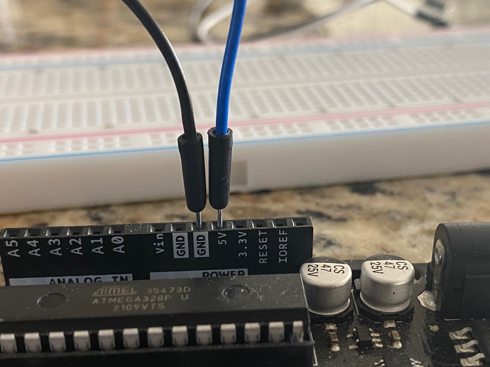
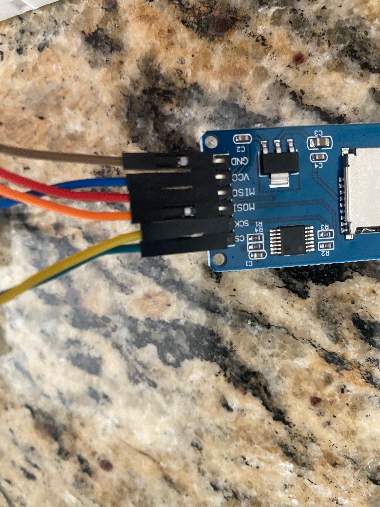
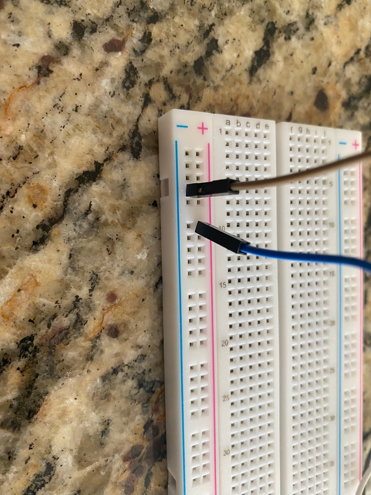
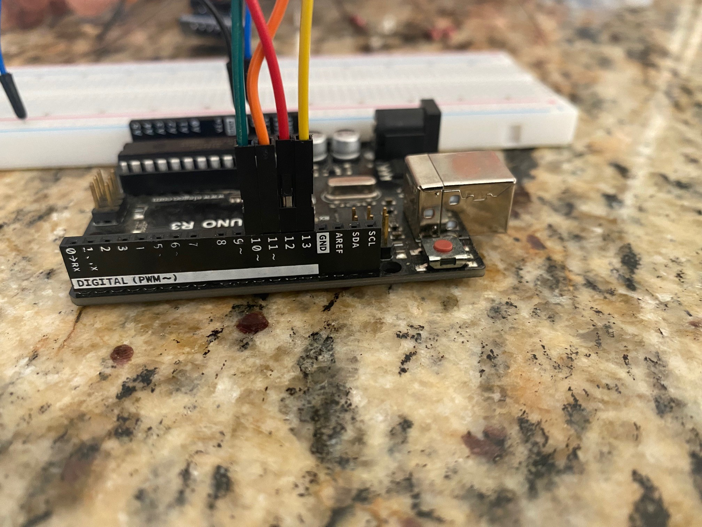
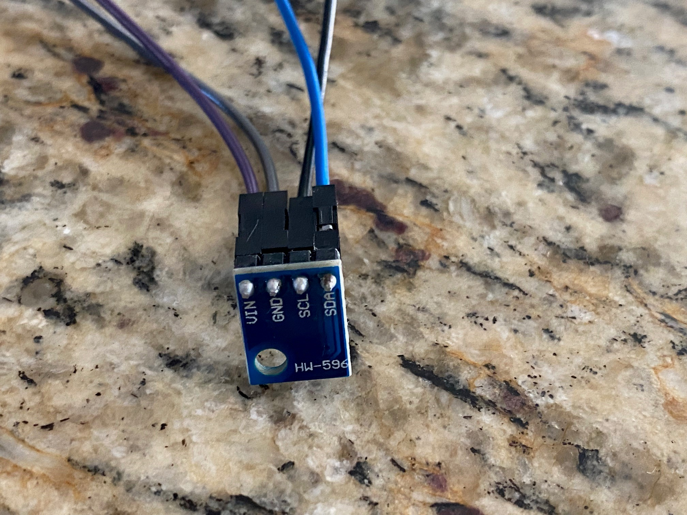
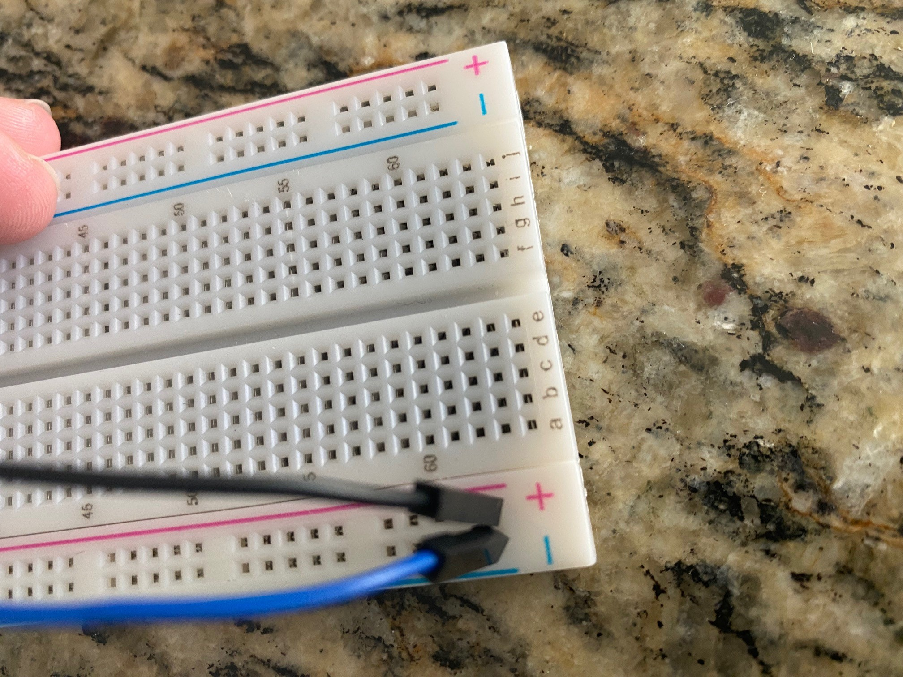

# Welcome to Lesson #6: putting it all together

## Making the Final Data Logger
<br>

#### Pre-requisites:
- It is recommended that you have successfully completed all the previous lessons 
<br><br>

#### Objectives:
- Breadboard the final circuit
- Create a device that logs data such as humidity, altitude and temperature onto a CSV file within a micro Sd card. 
<br><br>

#### What you will be using:
- [Arduino IDE](/c/arduino/lesson4/screenshots/arduino-ide.png)
- [Arduino Uno](/c/arduino/lesson4/screenshots/arduino-uno-r3.png)
- [MicroSD Card Module](/c/arduino/lesson5/screenshots/sd_card_module.png)
- [BMP 180](/c/arduino/lesson1/photos/BMP_both.jpg)
- [GPS module](/c/arduino/lesson1/photos/GPS_NEO-6M.JPG)
- [Breadboard](/c/arduino/lesson6/screenshots/breadboard.png)
- [Wires](/c/arduino/lesson3/screenshots/1956-02.jpg)
<br><br>

#### What you will be learning:
- How to connect multiple different sensors or devices to the Arduino at the same time
  -  Breadboarding circuits
- How to read a CSV file from the serial port
- Putting together all of the other lessons in order to make a final product
<br><br>

### Video Walk-through
In addition to the reading below, you can watch this [video](videos/Lesson6.mp4?raw=true) for guidance!
<br><br>

## Wiring all the sensors and devices to the Arduino
<br>

- Remember you do not have to use the same color of jumper wire as this, but insure that your connections are the same. 
- **Unplug the Arduino from the computer while you are wiring it up**
<br><br>

#### Wiring the Arduino to the Breadboard
<br>

Pin on the Arduino | Pin on the Breadboard
------ | ------
5v | Power on the breadboard
GND  | GND on the breadboard

<br>

<br><br>

#### Wiring the SD card
Pin on SD card reader | Pin on Arduino/breadboard 
------ | ------
GND   | GND on the breadboard
VCC   | Power on the breadboard
MISO   | 12  
MOSI   | 11  
SCK   | 13  
CS   | 10  

<br>
<br>

<br><br>

#### Wiring the BMP 180
Pin on the BMP 180 | Pin on Arduino/breadboard 
------ | ------
VIN | Power on the breadboard
GND   | GND on the breadboard
SCL   | A5
SDA   | A4 

<br>
<br>

<br><br>

#### Wiring the GPS
Pin on the GPS | Pin on Arduino/breadboard 
------ | ------
VCC | Power on the breadboard
GND   | GND on the breadboard
RXD | 4
TXD  | 3


<br>
<br>

<br><br>

## Full wire up

<br><br>

### Validate Libraries
Make sure that all the libraries below are installed in the IDE. Without these libraries the code below will not function and will error out.
* Adafruit bmp085 library
* BusIO
* TinyGPSPlus
<br><br>

### Working Code - Copy and paste this into your sketch 
``` 
/*
  SD card datalogger

  This example shows how to log data from three analog sensors
  to an SD card using the SD library.

  The circuit:
   analog sensors on analog ins 0, 1, and 2
   SD card attached to SPI bus as follows:
 ** MOSI - pin 11
 ** MISO - pin 12
 ** CLK - pin 13
 ** CS - pin 10 (for MKRZero SD: SDCARD_SS_PIN)

  created  24 Nov 2010
  modified 9 Apr 2012
  by Tom Igoe

  This example code is in the public domain.

*/

#include <SPI.h>
#include <SD.h>
#include "Adafruit_BMP085.h"
#include <TinyGPSPlus.h>
#include <SoftwareSerial.h>

const int chipSelect = 10;
const bool bypassGPS = true;

static const int RXPin = 4, TXPin = 3;
static const uint32_t GPSBaud = 9600;
TinyGPSPlus gps;

// map software serial to gps
SoftwareSerial serialgps(TXPin, RXPin);

Adafruit_BMP085 bmp;

void setup() {
  // Open serial communications and wait for port to open:
  Serial.begin(9600);
  delay(1000);


  Serial.print("initializing sd card...");

  // see if the card is present and can be initialized:
  if (!SD.begin(chipSelect)) {
    Serial.println("failed");
    // don't do anything more:
    while (1);
  }
  Serial.println("initialized");

  initBMP();
  initGPS();
}


void loop() {
  
  // make a string for assembling the data to log:
  String dataString = "";
  bool gpsready = false;

  unsigned long start = millis();
  do
  {
    while (serialgps.available()>0) {
      char c;
      c=serialgps.read();
      gps.encode(c);
    }
  } while (millis() - start < 5000);


  float c = bmp.readTemperature();  // Variable for holding temp in C
  float f = c*1.8 + 32.;  // Variable for holding temp in F
  //float pressure = bmp.readPressure()/3386.3887; //pascals to in of mercury
  float p = bmp.readPressure(); //pascals
  
  dataString += String(c, 2);
  dataString += ",";
  dataString += String(f, 2);
  dataString += ",";
  dataString += String(p, 2);
  dataString += ",";
  
  if ((gps.location.age() < 1000 || gps.location.isUpdated()) && gps.location.isValid()) {
    if (gps.satellites.isValid() && (gps.satellites.value() > 3)) {
      dataString += (gps.course.isValid() ? (int)gps.course.deg() : 0);
      dataString += ",";
      dataString += (gps.speed.isValid() ? (int)gps.speed.knots() : 0);
      dataString += ",";
      dataString += (gps.location.isValid() ? (long)gps.altitude.feet() : 0);
      dataString += ",";
      dataString += (gps.hdop.isValid() ? (int)gps.hdop.value() : 0);
      dataString += ",";
      dataString += (gps.satellites.isValid() ? (int)gps.satellites.value() : 0);
      dataString += ",";
      dataString += (gps.location.isValid() ? (int)gps.location.age() : 0);
    
      float lat = gps.location.isValid() ? gps.location.lat() : 0;
      float lng = gps.location.isValid() ? gps.location.lng() : 0;
      
      dataString += ",";
      dataString += String(lat, 6);
      dataString += ",";
      dataString += String(lng, 6);
      dataString += ",";
      dataString += gps.charsProcessed();
      dataString += ",";
      dataString += gps.failedChecksum();
      dataString += ",";

      if (gps.date.isValid())
      {
        if (gps.date.month() < 10) dataString += String(F("0"));
        dataString += String(gps.date.month());
        dataString += String(F("/"));
        if (gps.date.day() < 10) dataString += String(F("0"));
        dataString += String(gps.date.day());
        dataString += String(F("/"));
        if (gps.date.year() < 10) dataString += String(F("0"));
        dataString += String(gps.date.year());
      }
      else
        dataString += "00/00/00";

      dataString += String(F(","));
  
      if (gps.time.isValid())
      {
        if (gps.time.hour() < 10) dataString += String(F("0"));
        dataString += String(gps.time.hour());
        dataString += String(F(":"));
        if (gps.time.minute() < 10) dataString += String(F("0"));
        dataString += String(gps.time.minute());
        dataString += String(F(":"));
        if (gps.time.second() < 10) dataString += String(F("0"));
        dataString += String(gps.time.second());
        dataString += String(F("."));
        dataString += String(gps.time.centisecond());
      }

      gpsready = true;
    }
  }

  if (gpsready || bypassGPS) {
    // open the file. note that only one file can be open at a time,
    // so you have to close this one before opening another.
    File dataFile = SD.open("datalog.txt", FILE_WRITE);
  
    // if the file is available, write to it:
    if (dataFile) {
      dataFile.println(dataString);
      dataFile.close();
      // print to the serial port too:
      Serial.println(dataString);
    }
    // if the file isn't open, pop up an error:
    else {
      Serial.println("error opening datalog.txt");
    }
  }

  delay(2000);
}

void initGPS(){
  Serial.print("\ninitializing gps...");
  
  serialgps.begin(GPSBaud);
  delay(2000);
  if (!serialgps.available()) {
    Serial.println(F("initialization failed"));
    while (1);
  }
  else {
    Serial.println(F("initialized"));
  }
}

void initBMP(){
  Serial.print("\ninitializing bmp180...");

  unsigned status;
  
  status = bmp.begin();
  if (!status) {
    Serial.println(F("failed"));
  }
  else {
    Serial.println(F("initialized"));
  }
}
```
**Note**: If you are stopping/starting the code for troubleshooting issues, you may want to clear the contents of the SD card to validate correct functions.
<br><br>

## Want more?
If you have finished with the base lesson, check out the items below.
<br><br>

Things to think about, validate, and/or try:
* Is the data being written out correct? 🤔
* What are some things you could do to test all the modules at once?

Update the code to do any/all of the following:
1. Add appropriate output statements (like GPS Working - Satellites Not Found, GPS Working - Satellites found) for modules without data.
1. Change the order/format of the output file data to your liking.
1. Write the output as fast as the modules can be read. What is your speed? 😵
<br><br>

### Review
- Learned how to connect multiple different sensors or devices to the Arduino at the same time
  -  Breadboarding circuits
- How to read a CSV file from the serial port
- Put all of the other lessons together in order to make a final product
<br><br>

### Trouble shooting
- Unplug/reset the Arduino and check all of the connections and try running it again
- Sd card formatting needs to be fat32 or the program will not run
- GPS not reading coordinates is likely caused by obstruction of the signal so moving  outside may be necessary
- Validate that all libraries are installed for use (BMP180 and GPS)
<br><br>

### Need help?
Watch the walk-through [video](videos/Lesson6.mp4?raw=true) for guidance!
