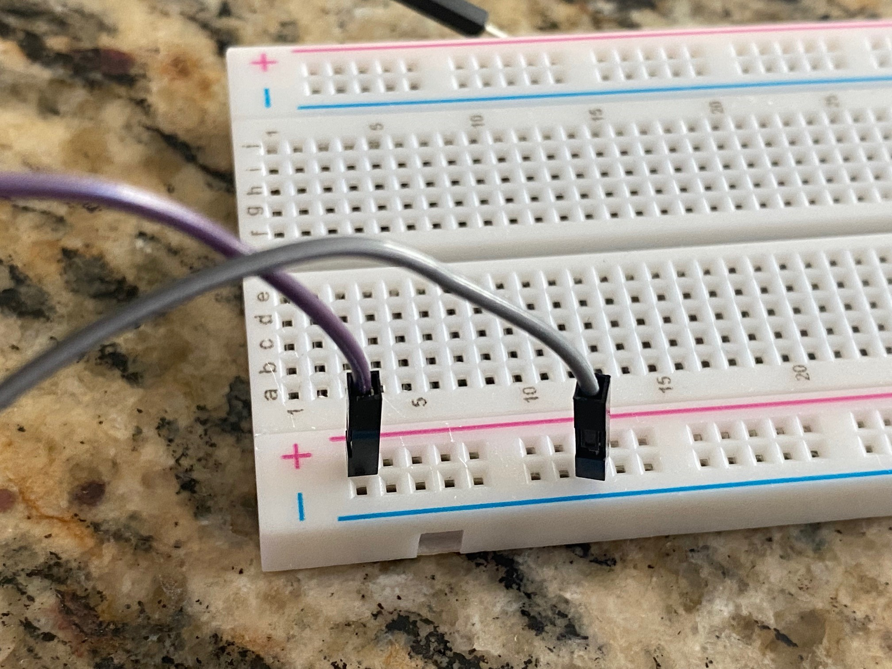
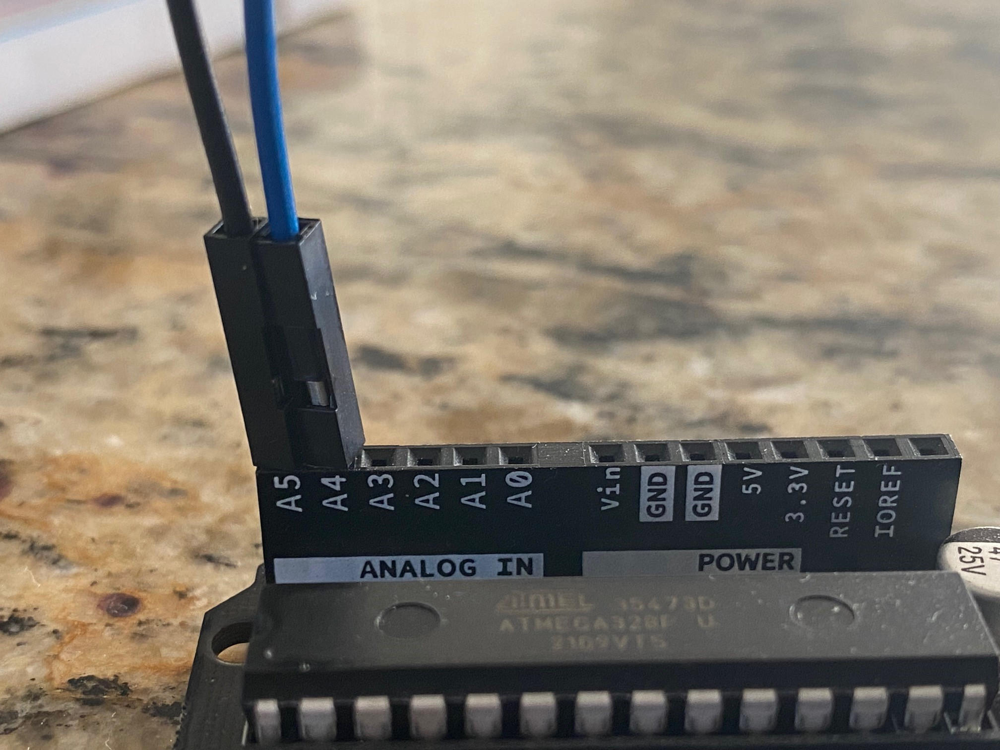
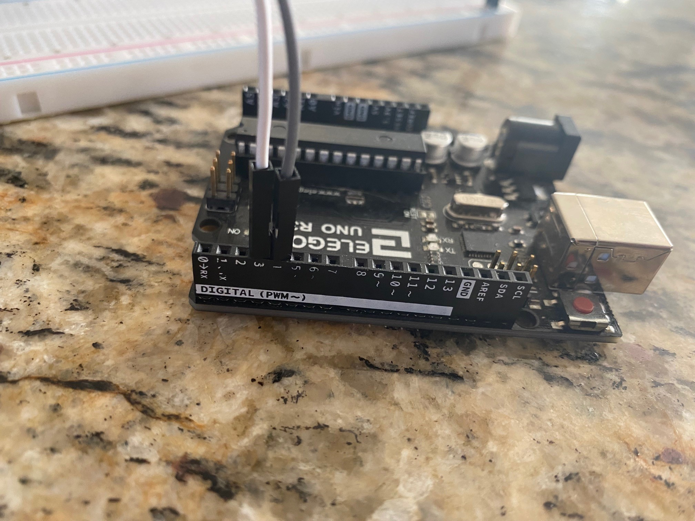

# Welcome to Lesson #6: putting it all together

## Making the Final Data Logger
<br>

#### Pre-requisites:
- It is recommended that you have successfully completed all the previous lessons 
<br><br>

#### Objectives:
- Breadboard the final circuit
- Create a device that logs data such as humidity, altitude and temperature onto a CSV file within a micro Sd card. 
<br><br>

#### What you will be using:
- [Arduino IDE](/c/arduino/lesson4/screenshots/arduino-ide.png)
- [Arduino Uno](/c/arduino/lesson4/screenshots/arduino-uno-r3.png)

- 

- [BMP 180](/c/arduino/lesson1/photos/BMP_both.jpg)
- [GPS module](/c/arduino/lesson1/photos/GPS_NEO-6M.JPG)
- [Breadboard](/c/arduino/lesson6/screenshots/breadboard.png)
- [Wires](/c/arduino/lesson3/screenshots/1956-02.jpg)
<br><br>

#### What you will be learning:
- How to connect multiple different sensors or devices to the Arduino at the same time
  -  Breadboarding circuits
- How to read a CSV file from the serial port
- Putting together all of the other lessons in order to make a final product
<br><br>

### Video Walk-through
In addition to the reading below, you can watch this [video](videos/Lesson6.mp4?raw=true) for guidance!
<br><br>

## Wiring all the sensors and devices to the Arduino
<br>

- Remember you do not have to use the same color of jumper wire as this, but insure that your connections are the same. 
- **Unplug the Arduino from the computer while you are wiring it up**
<br><br>

#### Wiring the Arduino to the Breadboard
<br>

Pin on the Arduino | Pin on the Breadboard
------ | ------
5v | Power on the breadboard
GND  | GND on the breadboard

<br>

<br><br>

#### Wiring the SD card
Pin on SD card reader | Pin on Arduino/breadboard 
------ | ------
GND   | GND on the breadboard
VCC   | Power on the breadboard
MISO   | 12  
MOSI   | 11  
SCK   | 13  
CS   | 10  

<br>
<br>

<br><br>

#### Wiring the BMP 180
Pin on the BMP 180 | Pin on Arduino/breadboard 
------ | ------
VIN | Power on the breadboard
GND   | GND on the breadboard
SCL   | A5
SDA   | A4 

<br>
<br>

<br><br>

#### Wiring the GPS
Pin on the GPS | Pin on Arduino/breadboard 
------ | ------
VCC | Power on the breadboard
GND   | GND on the breadboard
RXD | 4
TXD  | 3


<br>
<br>

<br><br>

## Full wire up

<br><br>

### Validate Libraries
Make sure that all the libraries below are installed in the IDE. Without these libraries the code below will not function and will error out.
* Adafruit bmp085 library
* BusIO
* TinyGPSPlus
<br><br>

### Working Code - Copy and paste this into your sketch 
``` 
#include <SPI.h>
#include "Adafruit_BMP085.h"
#include <TinyGPSPlus.h>
#include <SoftwareSerial.h>

#include <Adafruit_GFX.h>
#include <Adafruit_SSD1306.h>

#define SCREEN_WIDTH 128 // OLED display width, in pixels
#define SCREEN_HEIGHT 64 // OLED display height, in pixels

// Declaration for an SSD1306 display connected to I2C (SDA, SCL pins)
// The pins for I2C are defined by the Wire-library. 
// On an arduino UNO:       A4(SDA), A5(SCL)
// On an arduino MEGA 2560: 20(SDA), 21(SCL)
// On an arduino LEONARDO:   2(SDA),  3(SCL), ...
#define OLED_RESET     -1 // Reset pin # (or -1 if sharing Arduino reset pin)
#define SCREEN_ADDRESS 0x3C ///< See datasheet for Address; 0x3D for 128x64, 0x3C for 128x32
Adafruit_SSD1306 display(SCREEN_WIDTH, SCREEN_HEIGHT, &Wire, OLED_RESET);

const int chipSelect = 10;
const bool bypassGPS = true;

static const int RXPin = 4, TXPin = 3;
static const uint32_t GPSBaud = 9600;
TinyGPSPlus gps;

// map software serial to gps
SoftwareSerial serialgps(TXPin, RXPin);

Adafruit_BMP085 bmp;

void setup() {
  // SSD1306_SWITCHCAPVCC = generate display voltage from 3.3V internally
  if(!display.begin(SSD1306_SWITCHCAPVCC, SCREEN_ADDRESS)) {
    //Serial.println(F("SSD1306 allocation failed"));
    for(;;); // Don't proceed, loop forever
  }

  // Show initial display buffer contents on the screen --
  // the library initializes this with an Adafruit splash screen.
  display.display();

  //Serial.print(F("initializing sd card..."));

  //initBMP();
  bmp.begin();

  //initGPS();
  serialgps.begin(GPSBaud);
  delay(2000);
  if (!serialgps.available()) {
    //Serial.println(F("initialization failed"));
    for(;;);
  }
}

void loop() {
  
  // make a string for assembling the data to log:
  String dataString = "";
  bool gpsready = false;

  float lat = 0;
  float lng = 0;

  unsigned long start = millis();
  do
  {
    while (serialgps.available()>0) {
      char c;
      c=serialgps.read();
      gps.encode(c);
    }
  } while (millis() - start < 5000);


  float c = bmp.readTemperature();  // Variable for holding temp in C
  float f = c*1.8 + 32.;  // Variable for holding temp in F
  //float pressure = bmp.readPressure()/3386.3887; //pascals to in of mercury
  float p = bmp.readPressure(); //pascals
  
  if ((gps.location.age() < 1000 || gps.location.isUpdated()) && gps.location.isValid()) {
    if (gps.satellites.isValid() && (gps.satellites.value() > 3)) {
      lat = gps.location.isValid() ? gps.location.lat() : 0;
      lng = gps.location.isValid() ? gps.location.lng() : 0;

      gpsready = true;
    }
  }

  if (gpsready || bypassGPS) {   

      // Clear the buffer
      display.clearDisplay();

      display.setTextSize(1);             // Normal 1:1 pixel scale
      display.setTextColor(SSD1306_WHITE);        // Draw white text
      display.setCursor(0,0);             // Start at top-left corner
      display.print(F("Temperature: "));
      display.print(f);
      display.print(F(" F"));

      display.setTextSize(1);             // Normal 1:1 pixel scale
      display.setTextColor(SSD1306_WHITE);        // Draw white text
      display.setCursor(0,9);             // Start at top-left corner
      display.print(F("Pressure: "));
      display.print(p);

      display.setTextSize(1);             // Normal 1:1 pixel scale
      display.setTextColor(SSD1306_WHITE);        // Draw white text
      display.setCursor(0,18);             // Start at top-left corner
      display.print(F("Lat: "));
      display.print(String(lat, 6));

      display.setTextSize(1);             // Normal 1:1 pixel scale
      display.setTextColor(SSD1306_WHITE);        // Draw white text
      display.setCursor(0,27);             // Start at top-left corner
      display.print(F("Lng: "));
      display.print(String(lng, 6));

      display.setTextSize(1);             // Normal 1:1 pixel scale
      display.setTextColor(SSD1306_WHITE);        // Draw white text
      display.setCursor(0,36);             // Start at top-left corner
      display.print(F("Altidtude: "));
      display.print(String((long)gps.altitude.feet(), 6));

      display.setTextSize(1);             // Normal 1:1 pixel scale
      display.setTextColor(SSD1306_WHITE);        // Draw white text
      display.setCursor(0,45);             // Start at top-left corner
      display.print(F("Satellites: "));
      display.print(String((int)gps.satellites.value()));

      // Show the display buffer on the screen. You MUST call display() after
      // drawing commands to make them visible on screen!
      display.display();    
  }

  delay(2000);
}
```
**Note**: If you are stopping/starting the code for troubleshooting issues, you may want to clear the contents of the SD card to validate correct functions.
<br><br>

## Want more?
If you have finished with the base lesson, check out the items below.
<br><br>

Things to think about, validate, and/or try:
* Is the data being written out correct? 🤔
* What are some things you could do to test all the modules at once?

Update the code to do any/all of the following:
1. Add appropriate output statements (like GPS Working - Satellites Not Found, GPS Working - Satellites found) for modules without data.
1. Change the order/format of the output file data to your liking.
1. Write the output as fast as the modules can be read. What is your speed? 😵
<br><br>

### Review
- Learned how to connect multiple different sensors or devices to the Arduino at the same time
  -  Breadboarding circuits
- How to read a CSV file from the serial port
- Put all of the other lessons together in order to make a final product
<br><br>

### Trouble shooting
- Unplug/reset the Arduino and check all of the connections and try running it again
- Sd card formatting needs to be fat32 or the program will not run
- GPS not reading coordinates is likely caused by obstruction of the signal so moving  outside may be necessary
- Validate that all libraries are installed for use (BMP180 and GPS)
<br><br>

### Need help?
Watch the walk-through [video](videos/Lesson6.mp4?raw=true) for guidance!
