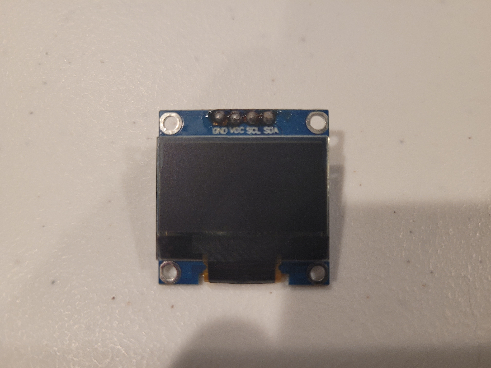
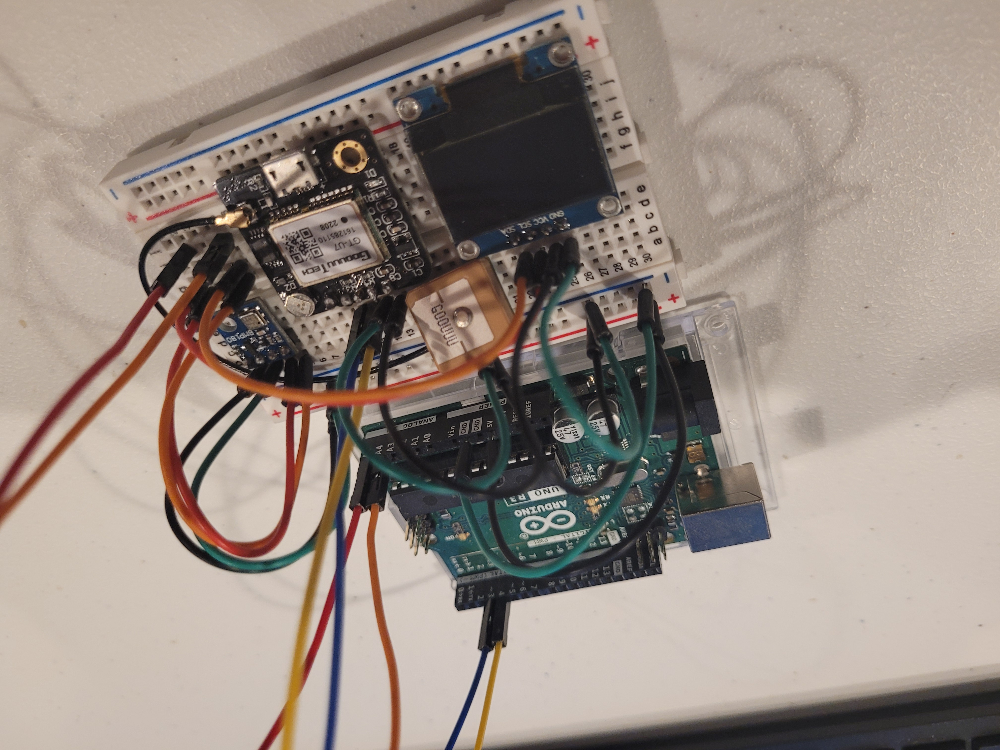
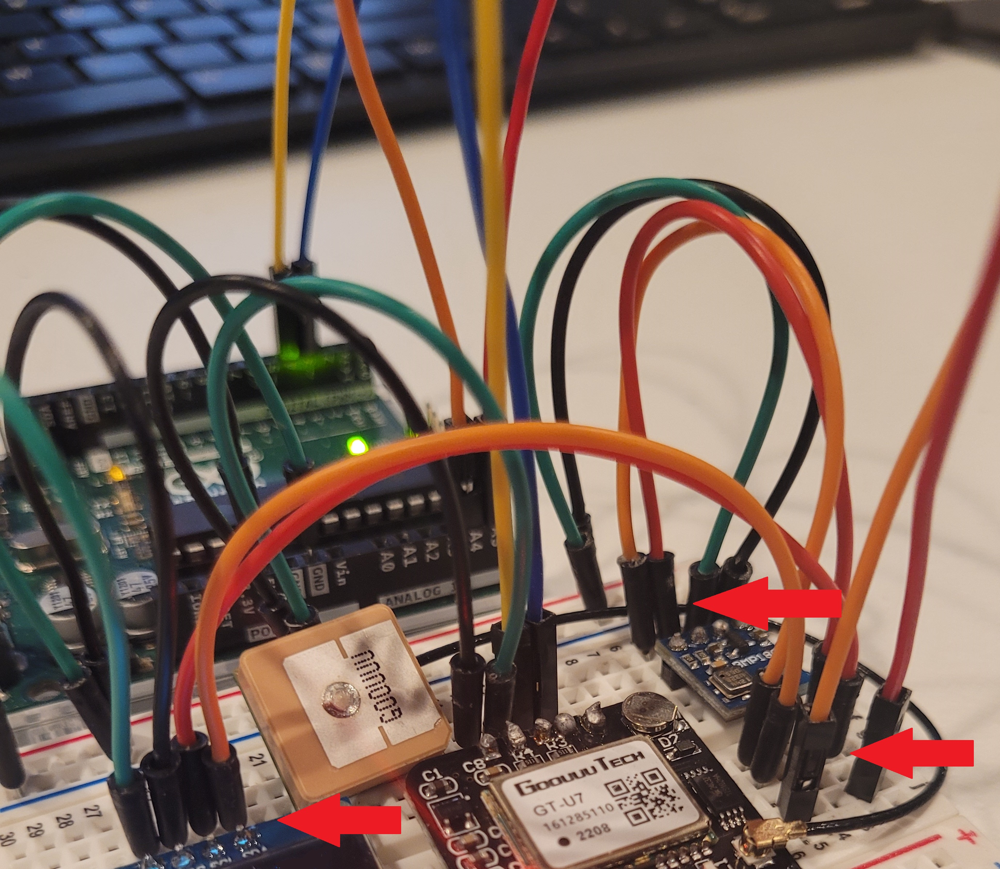

# Welcome to Lesson #7: oLED Display

## Present data to a display
<br>

#### Pre-requisites:
- It is recommended that you have successfully completed all the previous lessons 
<br><br>

#### Objectives:
- Breadboard the final circuit with an oLED
- Create a device that logs data such as pressure, altitude and temperature and displays onto a oLED display.
<br><br>

#### What you will be using:
- [Arduino IDE](/c/arduino/lesson4/screenshots/arduino-ide.png)
- [Arduino Uno](/c/arduino/lesson4/screenshots/arduino-uno-r3.png)

- 

- [BMP 180](/c/arduino/lesson1/photos/BMP_both.jpg)
- [GPS module](/c/arduino/lesson1/photos/GPS_NEO-6M.JPG)
- [Breadboard](/c/arduino/lesson6/screenshots/breadboard.png)
- [Wires](/c/arduino/lesson3/screenshots/1956-02.jpg)
<br><br>

#### What you will be learning:
- How to connect multiple different sensors or devices to the Arduino at the same time
  -  Breadboarding circuits
- How to write to an oLED display
- Connecting multiple [I2C](https://en.wikipedia.org/wiki/I%C2%B2C) modules
- Putting together all of the other lessons in order to make a final product
<br><br>

<!-- ### Video Walk-through
In addition to the reading below, you can watch this [video](videos/Lesson7.mp4?raw=true) for guidance!
<br><br> -->

## Wiring all the sensors and devices to the Arduino
<br>

- Remember you do not have to use the same color of jumper wire as this, but insure that your connections are the same. 
- In this lesson, we will be sharing the A4/A5 wires as the devices are I2C. Take note of the common wire up.
- **Unplug the Arduino from the computer while you are wiring it up**
<br><br>

#### Wiring the Arduino to the Breadboard
<br>

Module/Controller Pin | BB/Arduino Pins
----------- | ------------
**oLED Display**||
GND         | BB Ground (-)
VCC         | BB Power (+)
SCL         | Common SCL (Arduino A5)
SDA         | Common SDA (Arduino A4)
**GPS Sensor**||
VCC         | BB Power (+)
GND         | BB Ground (-)
PPS         | N/A
TXD         | 3
RXD         | 4
**Pressure Temperature Sensor**||
VIN         | BB Power (+)
GND         | BB Ground (-)
SCL         | Common SCL (Arduino A5)
SDA         | Common SDA (Arduino A4)
**Arduino**||
5V          | BB Power (+)
GND         | BB Ground (-)

## Full wire up

<br><br>

## Common SCL/SDA
The BMP180 and oLED Display will share the SCL/SDA A5/A4 spot on the Arduino. [I2C](https://en.wikipedia.org/wiki/I%C2%B2C) addresses are used to differentiate between the two modules.
<br>

<br><br>

### Validate Libraries
Make sure that all the libraries below are installed in the IDE. Without these libraries the code below will not function and will error out.
* Adafruit bmp085 library
* BusIO
* TinyGPSPlus

***NOTE***: A new library is needed for this build. Install ```Adafruit SSD1306``` library through the Arduino IDE by going to Sketch -> Include Library -> Manage Libraries -> then search for ```Adafruit SSD1306```. Install the depending ```Adafruit GFX``` library as well.
<br><br>

### Working Code - Copy and paste this into your sketch 
``` 
#include <SPI.h>
#include "Adafruit_BMP085.h"
#include <TinyGPSPlus.h>
#include <SoftwareSerial.h>

#include <Adafruit_GFX.h>
#include <Adafruit_SSD1306.h>

#define SCREEN_WIDTH 128 // OLED display width, in pixels
#define SCREEN_HEIGHT 64 // OLED display height, in pixels

// Declaration for an SSD1306 display connected to I2C (SDA, SCL pins)
// The pins for I2C are defined by the Wire-library. 
// On an arduino UNO:       A4(SDA), A5(SCL)
// On an arduino MEGA 2560: 20(SDA), 21(SCL)
// On an arduino LEONARDO:   2(SDA),  3(SCL), ...
#define OLED_RESET     -1 // Reset pin # (or -1 if sharing Arduino reset pin)
#define SCREEN_ADDRESS 0x3C ///< See datasheet for Address; 0x3D for 128x64, 0x3C for 128x32
Adafruit_SSD1306 display(SCREEN_WIDTH, SCREEN_HEIGHT, &Wire, OLED_RESET);

const int chipSelect = 10;
const bool bypassGPS = true;

static const int RXPin = 4, TXPin = 3;
static const uint32_t GPSBaud = 9600;
TinyGPSPlus gps;

// map software serial to gps
SoftwareSerial serialgps(TXPin, RXPin);

Adafruit_BMP085 bmp;

void setup() {
  // SSD1306_SWITCHCAPVCC = generate display voltage from 3.3V internally
  if(!display.begin(SSD1306_SWITCHCAPVCC, SCREEN_ADDRESS)) {
    //Serial.println(F("SSD1306 allocation failed"));
    for(;;); // Don't proceed, loop forever
  }

  // Show initial display buffer contents on the screen --
  // the library initializes this with an Adafruit splash screen.
  display.display();

  bmp.begin();

  serialgps.begin(GPSBaud);
  delay(2000);
  if (!serialgps.available()) {
    //Serial.println(F("initialization failed"));
    for(;;);
  }
}

void loop() {
  
  // make a string for assembling the data to log:
  String dataString = "";
  bool gpsready = false;

  float lat = 0;
  float lng = 0;

  unsigned long start = millis();
  do
  {
    while (serialgps.available()>0) {
      char c;
      c=serialgps.read();
      gps.encode(c);
    }
  } while (millis() - start < 5000);


  float c = bmp.readTemperature();  // Variable for holding temp in C
  float f = c*1.8 + 32.;  // Variable for holding temp in F
  //float pressure = bmp.readPressure()/3386.3887; //pascals to in of mercury
  float p = bmp.readPressure(); //pascals
  
  if ((gps.location.age() < 1000 || gps.location.isUpdated()) && gps.location.isValid()) {
    if (gps.satellites.isValid() && (gps.satellites.value() >= 3)) {
      lat = gps.location.isValid() ? gps.location.lat() : 0;
      lng = gps.location.isValid() ? gps.location.lng() : 0;

      gpsready = true;
    }
  }

  if (gpsready || bypassGPS) {   

      // Clear the buffer
      display.clearDisplay();

      display.setTextSize(1);             // Normal 1:1 pixel scale
      display.setTextColor(SSD1306_WHITE);        // Draw white text
      display.setCursor(0,0);             // Start at top-left corner
      display.print(F("Temperature: "));
      display.print(f);
      display.print(F(" F"));

      display.setTextSize(1);             // Normal 1:1 pixel scale
      display.setTextColor(SSD1306_WHITE);        // Draw white text
      display.setCursor(0,9);             // Start at top-left corner
      display.print(F("Pressure: "));
      display.print(p);

      display.setTextSize(1);             // Normal 1:1 pixel scale
      display.setTextColor(SSD1306_WHITE);        // Draw white text
      display.setCursor(0,18);             // Start at top-left corner
      display.print(F("Lat: "));
      display.print(String(lat, 6));

      display.setTextSize(1);             // Normal 1:1 pixel scale
      display.setTextColor(SSD1306_WHITE);        // Draw white text
      display.setCursor(0,27);             // Start at top-left corner
      display.print(F("Lng: "));
      display.print(String(lng, 6));

      display.setTextSize(1);             // Normal 1:1 pixel scale
      display.setTextColor(SSD1306_WHITE);        // Draw white text
      display.setCursor(0,36);             // Start at top-left corner
      display.print(F("Altidtude: "));
      display.print(String((long)gps.altitude.feet(), 6));

      display.setTextSize(1);             // Normal 1:1 pixel scale
      display.setTextColor(SSD1306_WHITE);        // Draw white text
      display.setCursor(0,45);             // Start at top-left corner
      display.print(F("Satellites: "));
      display.print(String((int)gps.satellites.value()));

      // Show the display buffer on the screen. You MUST call display() after
      // drawing commands to make them visible on screen!
      display.display();    
  }

  delay(2000);
}
```
<br>

## Want more?
If you have finished with the base lesson, check out the items below.
<br><br>

Things to think about, validate, and/or try:
* Is the data being written out correct? 🤔
* What are some things you could do to test all the modules at once?

Update the code to do any/all of the following:
1. Change the order/format of the output display data to your liking.
1. Load the demo display code to see the full power of the oLED! 😵 (File > Adafruit SSD1306 > ssd1306_128x64_i2c) (***HINT:*** Change the ```SCREEN_ADDRESS``` to ```0x3C```)
1. Create you own custom image, load it into a byte array, and display your image on the the oLED. [Try it out!](https://www.instructables.com/How-to-Display-Images-on-OLED-Using-Arduino/) 🐧
<br><br>

### Review
- Learned how to connect multiple different sensors or devices to the Arduino at the same time
  -  Breadboarding circuits
- How to display to an oLED Display
- Put all of the other lessons together in order to make a final product
<br><br>

### Trouble shooting
- Unplug/reset the Arduino and check all of the connections and try running it again
- GPS not reading coordinates is likely caused by obstruction of the signal so moving  outside may be necessary
- Validate that all libraries are installed for use (BMP180 and GPS)
- No display change? GPS never initialized and code is stuck. Validate GPS is setup correctly.
<br><br>

<!-- ### Need help?
Watch the walk-through [video](videos/Lesson6.mp4?raw=true) for guidance! -->
