# High Altitude Balloon Data Logging Project

## Pre-requisites
* Windows 10 or 11 machine
* 20GB or more free space on the hard drive


## Objective
This lesson will setup the development environment on a Windows machine.
If you have another os, please see the Rasberry Pi Pico getting started document that should be found here: https://datasheets.raspberrypi.com/pico/getting-started-with-pico.pdf


## 1. Install Arm GNU Toolchain.

We will want to download the latest production release from their website. Ensure you are not downloading the latest beta, it defaults to showing you that first.

There are usually 6 files for each release, you want the one ending with `-arm-none-eabi.exe`

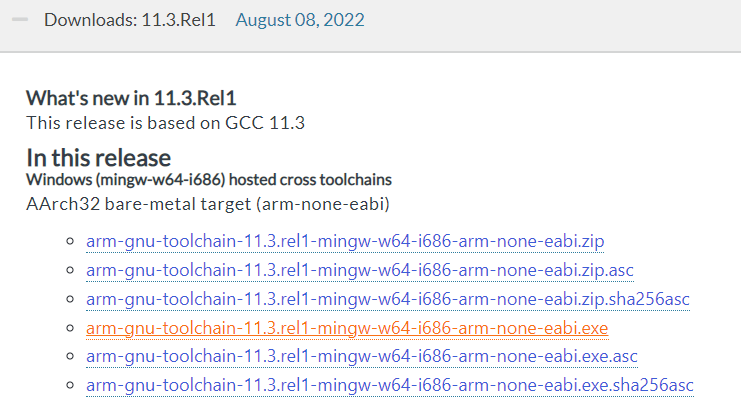

After downloading the file, run it to install. Make sure to check the option to `Add path to environment variable` before clicking finish. 

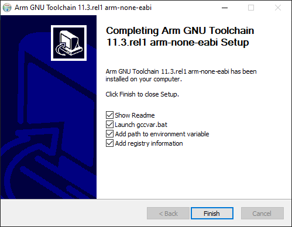


## 2. Install CMake.
Download the latest release for Windows x64 installer from here: 
https://cmake.org/download/

During the install, ensure to select the option to add to the path for all users.

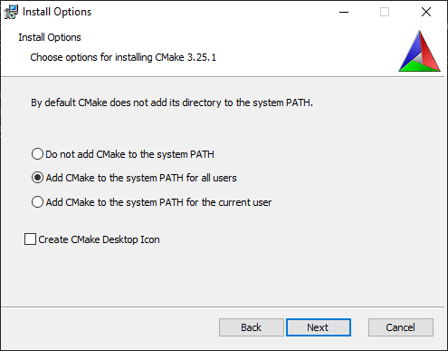


## 3. Install Build Toold for Visual Studio 2022.
Download the latest from here: https://visualstudio.microsoft.com/downloads/#build-tools-for-visual-studio-2022

Run and just install the `Desktop Development with C++`

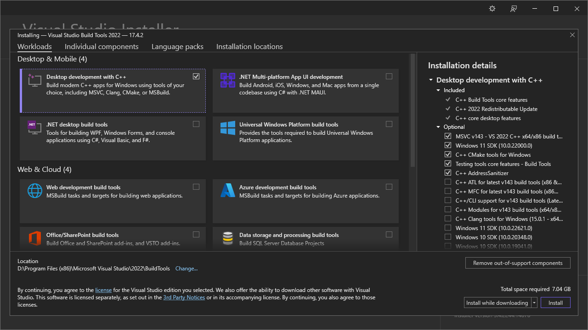


## 4. Install Python
Download the latest Windows installer 64 bit available from here:
https://www.python.org/downloads/windows/

Make sure go through customize the install, and check options for
* always added to the path
* always installed for all users
* run the option to "Disable the path length limit"

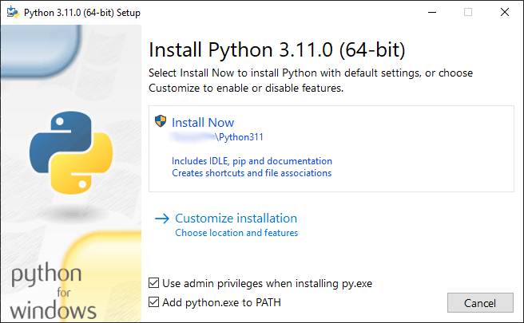

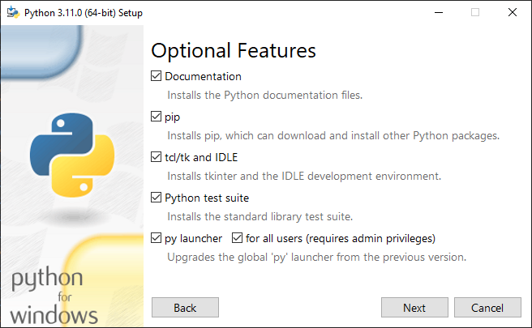

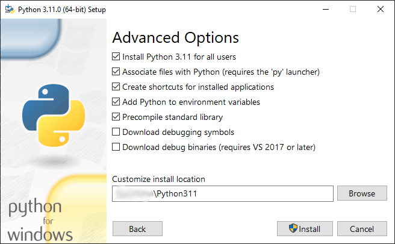


## 5. Install git
Download the latest version for the Standalone 64-bit for Windows Setup from here: https://git-scm.com/download/win
* Change from VIM to use VS Code as your default editor.
* Change option to use "Git from the command line and also from 3rd-party software"
* Change option to "Checkout as-is, commit as-is"
* Change option to "Use Windows' default console window"
* Select option to "Enable experimental support for pseudo consoles"

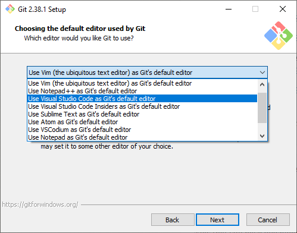
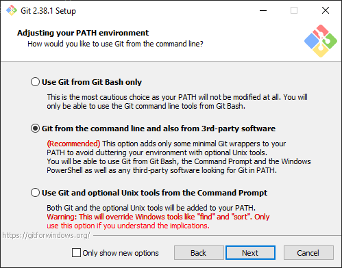
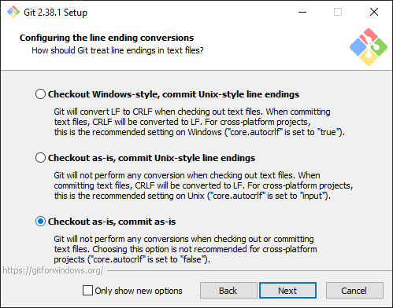
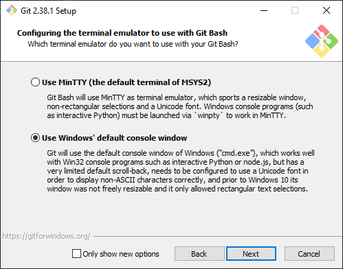
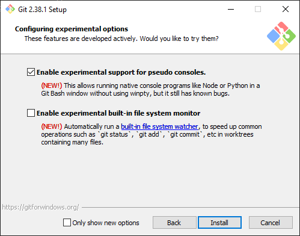


## 6. Install Pico SDK
Open a new command prompt window by clicking on start, then type cmd, then run the command window app. 
NOTE: Do not use windows terminal for this. It won't work as expected.

From the command prompt
```
git clone https://github.com/raspberrypi/pico-sdk.git --branch master
cd pico-sdk
git submodule update --init
setx PICO_SDK_PATH %cd%
Close the command prompt window
```

## 7. Install PuTTY
Download and install the Windows Install 64-bit x86 from here:
https://www.chiark.greenend.org.uk/~sgtatham/putty/latest.html


## 8. Install Visual Studio Code
Download and install the Windows x64 system installer from here:
https://code.visualstudio.com/download

Run VSCode

* Click, View, Extensions or click the extensions icon on the left
* Search for `C/C++ Extension Pack`, ensure you have the one published by Microsoft and install it
* Search for `Python`, ensure you have the one published by Microsoft and install it.
* Click on the Manage icon (looks like a gear) in the lower left hand corner of VSCode.
* Select Settings
* Search for `cmake.generator`
* Set the value to `NMake Makefiles`


## 9. Clone the base project
Click on start, start typing "Developer", open the "Developer Command Prompt for VS 2022" application.

Change to your user profile directory with 
```
cd %USERPROFILE
```

Sparse clone just the code needed for this path: 
```
git clone --filter=blob:none --sparse https://github.com/StateFarm-STEM/hablogger.git && cd hablogger && git sparse-checkout add c/raspberrypico
```


## 10. Restart your machine
Restart before moving on to the next lesson. This is very important to ensure the new paths and environment settings all take effect.


## How to Open the code project
You will use these instructions to open the project for all the following lessions. Refer back to these instructions if you have any errors with missing files.

Click on start, start typing "Developer", open the "Developer Command Prompt for VS 2022" application.
* Tip: Pin to your start menu or taskbar, we will use this a lot in the future.

Change to your user profile directory 
```
cd %USERPROFILE
```

Open VS code in the code directory 
```
code hablogger\c\raspberrypico\code
```
