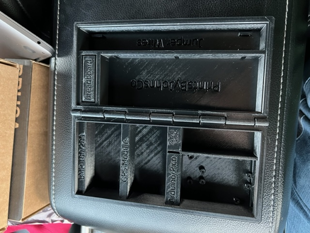
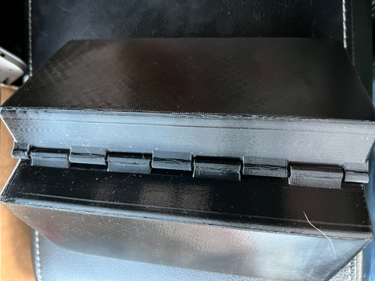
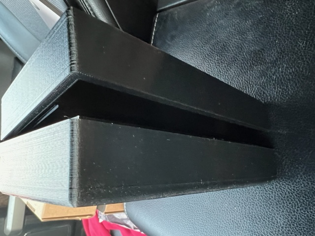
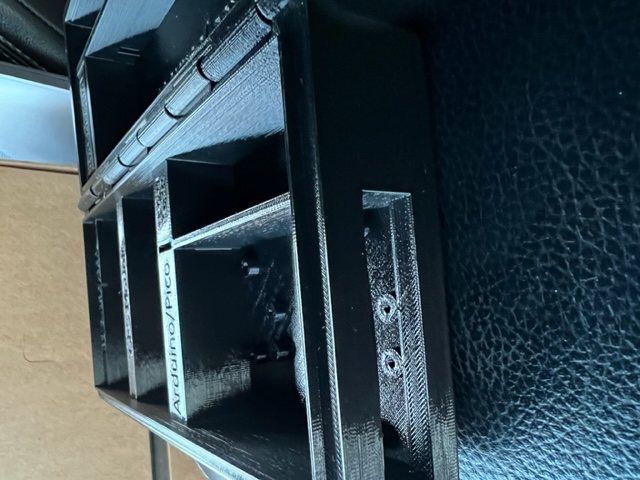

### Workbench to contain all the electronics needed for classroom use

## Background

- This was created by a student from our first launch who later interned with the STEM team
- Research was done looking at similar projects on [thingverse.com](https://thingverse.com/)
  - We found some that were close but either wouldnt take the expected classroom abuse or had the chance of loosing components
  - Static was a big concern as well with students handling components and replacing them in the plastic or cardboard kit boxes
- The idea we had was to create somehting similar to a compartment box with compartments for each component, have standoffs to screw the components in, storage for jumper wires, and a location for the breadboard. 

## Protype #1

- View into the box from an open position. Notice the spaces labeled and standoffs for the two microcontrollers. We are getting the parts we will be using to emasure the standoffs for the other components. We have found different versions have different boards and mounts.  
  
- The hinge for the box is printed in place
  
- An inner lip was created in the box to ensure a tight fit and loose parts wouldnt slip out
  
- the space for the microcontrollers (holds both the Arduino and Pico) has access to ports on the ends
  

