# Proposed hardware for the Raspberry Pico

## Listed below are proposed components for using Python on the Raspberry Pico
 
- I have added both micro SD card and a standard SD for size identification, these parts are small!
 
 

## BME-280 - Records temperature, humidity, and barametric pressure

- BME280 - Front
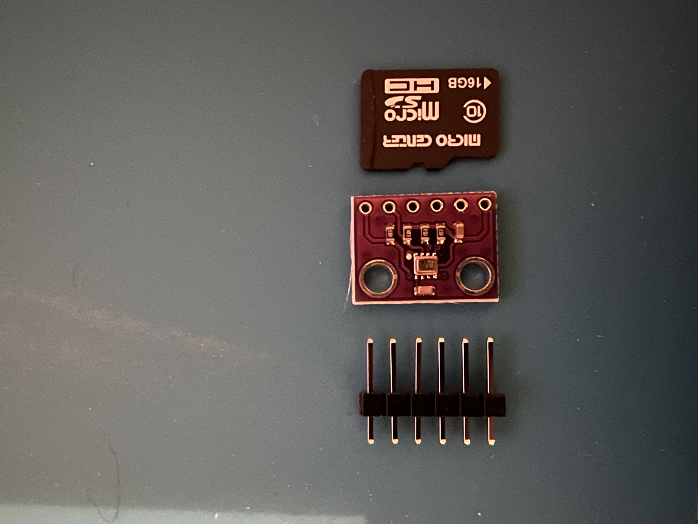
- BME280 - Back
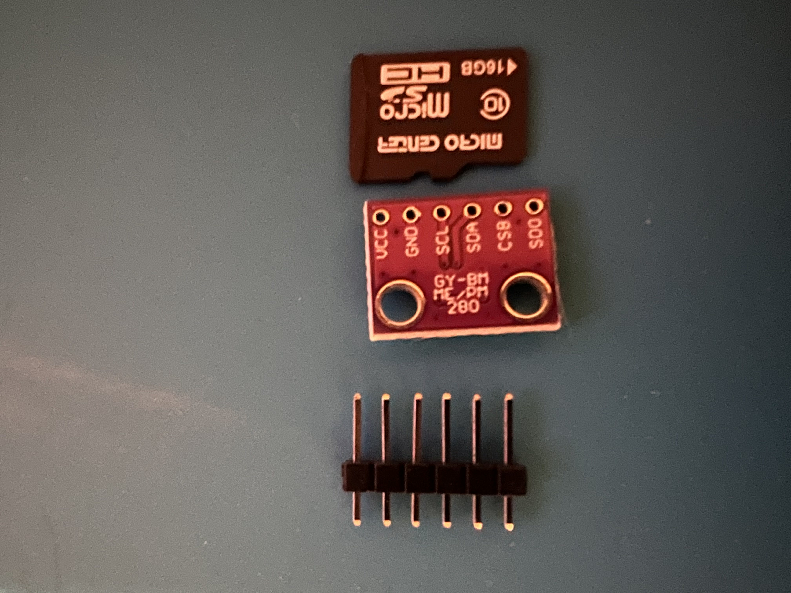

## ESP32 Camera Module - Records pictures and videos, stores to SD, Wireless capabilities, and USB interface for programing and power

- ESP32 Camera Madule Camera Attached
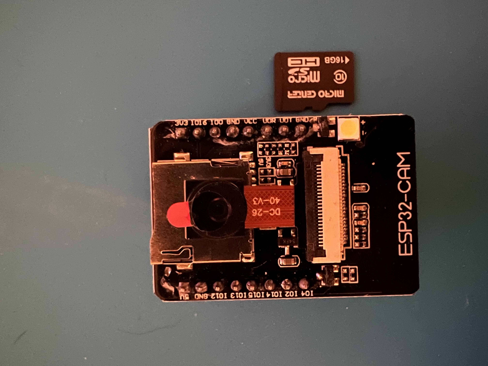
ESP32 Camera Madule Camera detached
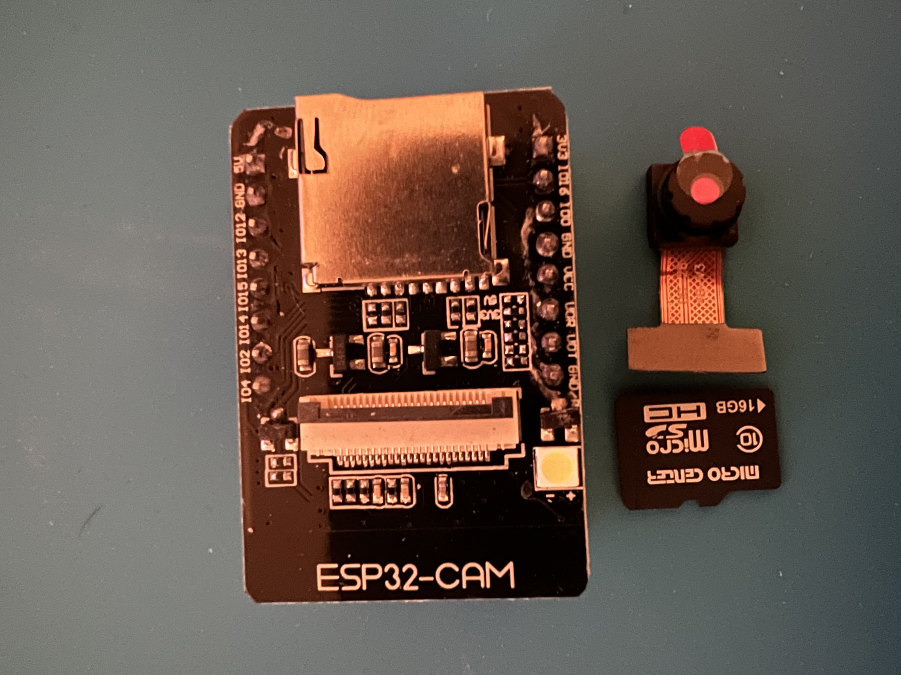
ESP32 Camera Madule Camera SD
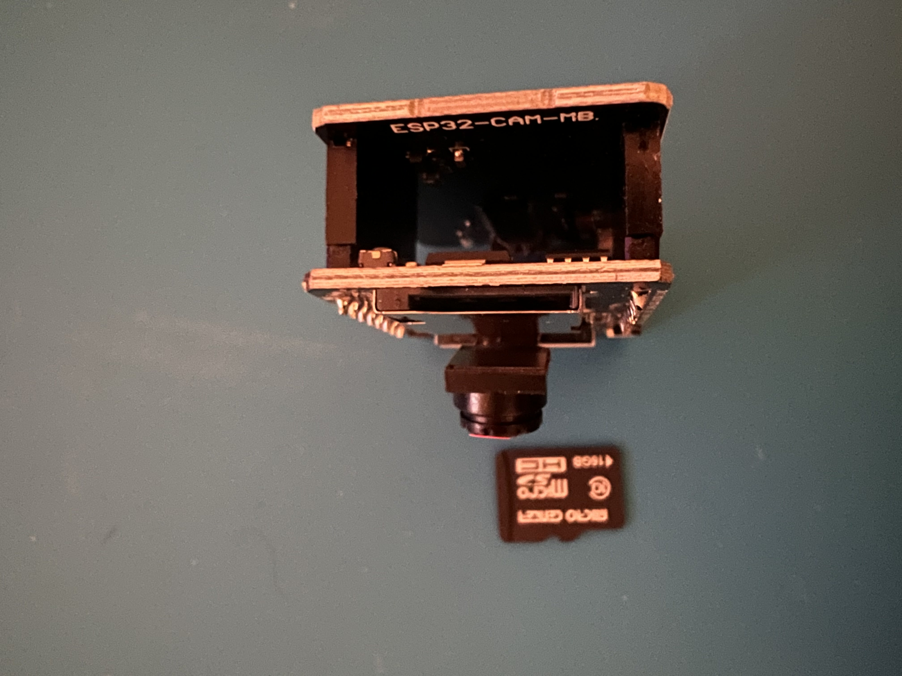
ESP32 Camera Madule Camera USB Connector
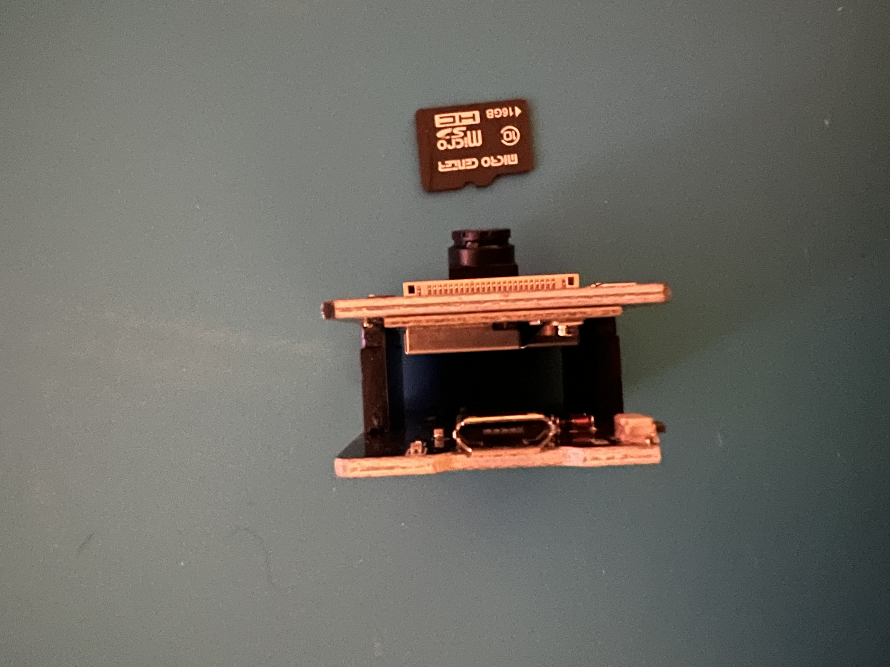
ESP32 Camera Madule Camera Back
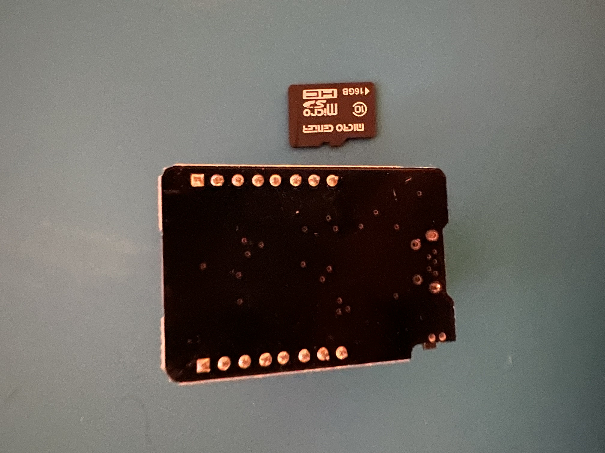

## [MPU-9250 - accelerometer, a gyroscope, and a magnetometer](https://components101.com/sensors/MPU9250-9-dof-mems-sensor-module-datasheet-pinout-features-working)

- MPU-9250 - Front

- MPU-9250 - Back
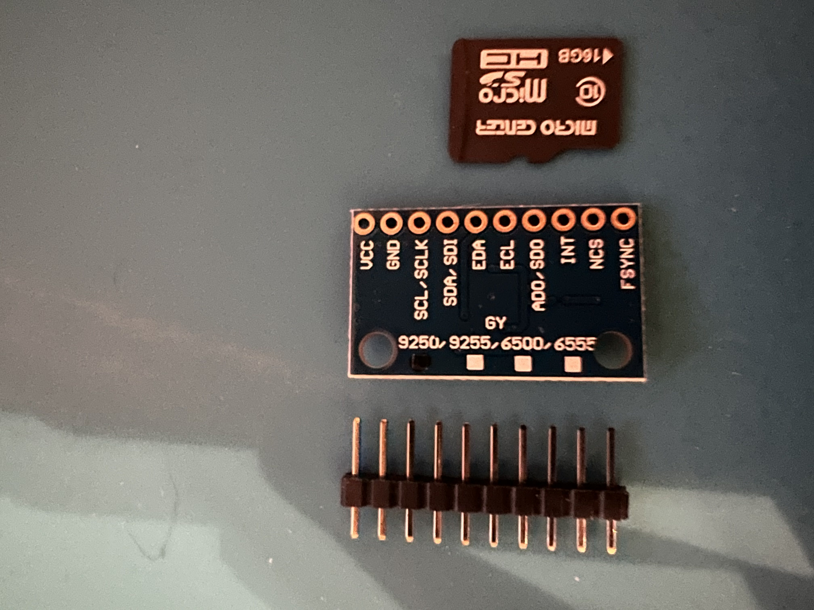

## Raspberry Pico - Raspberry offering of a microcontroller

- All Raspberry Pico Offerings
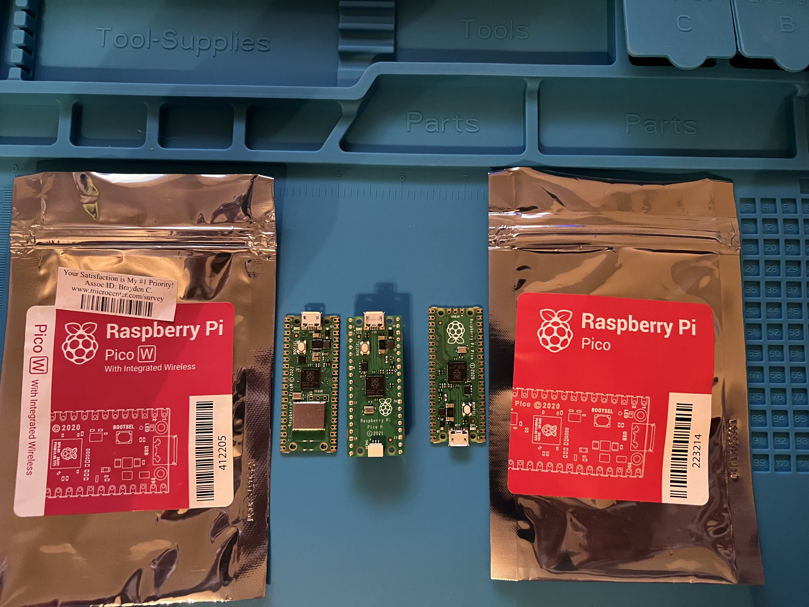
- Raspberry Pico

- Raspberry Pico H - Headers
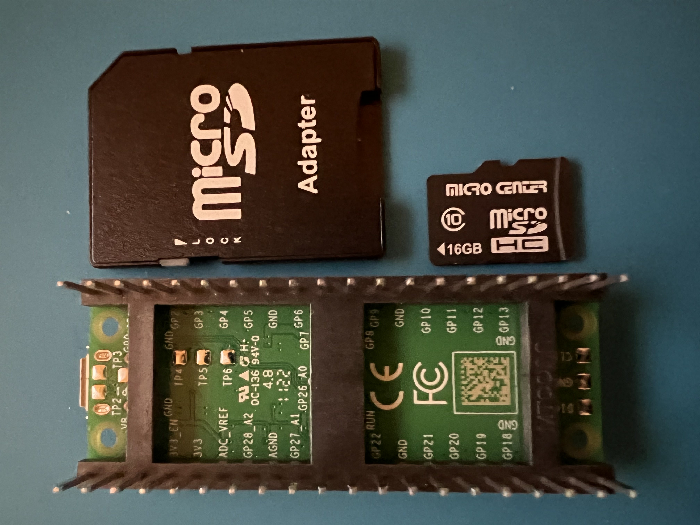
- Raspberry Pico H - Front

- Raspberry Pico W - Wireless
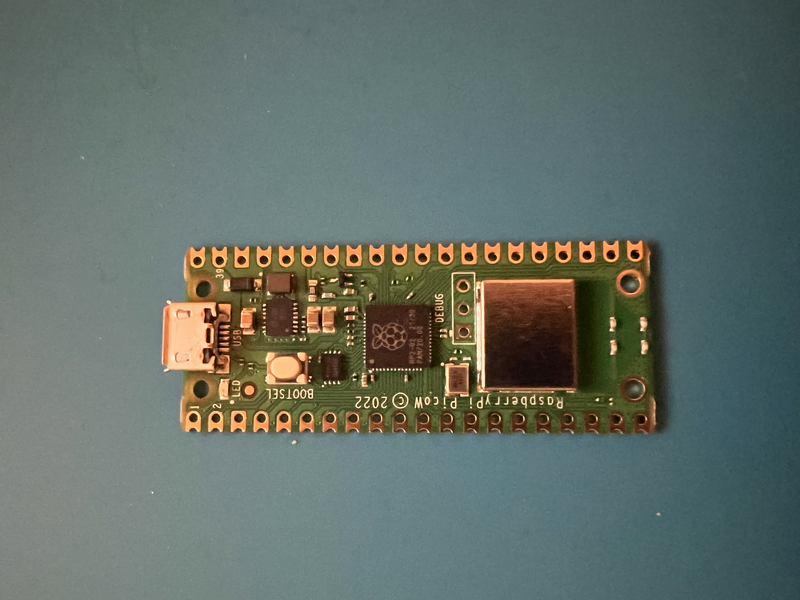

## SD Reader - Enables SD card access to the microcontroller

- Front SD Card Reader
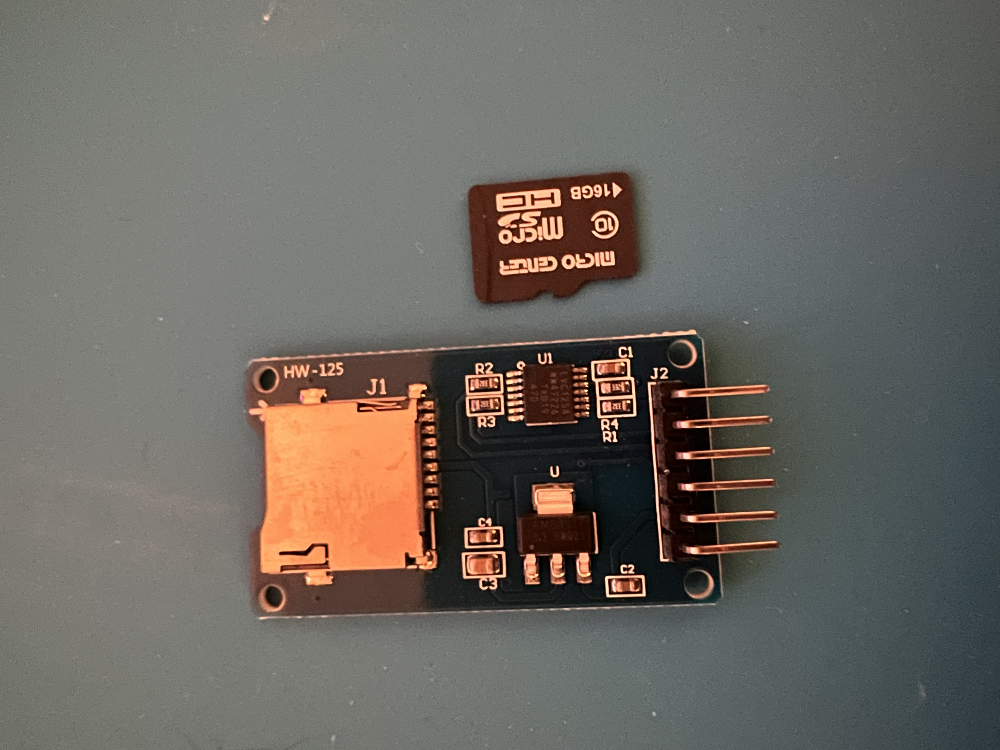
- Back SD Card Reader
