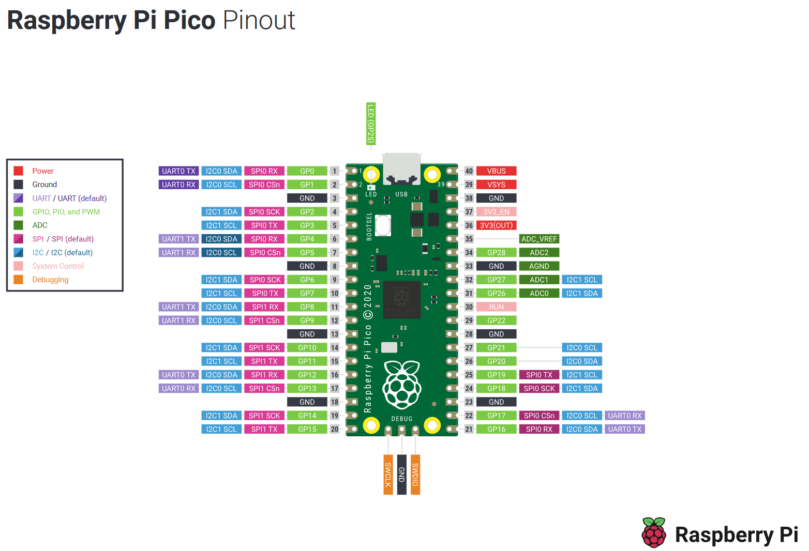
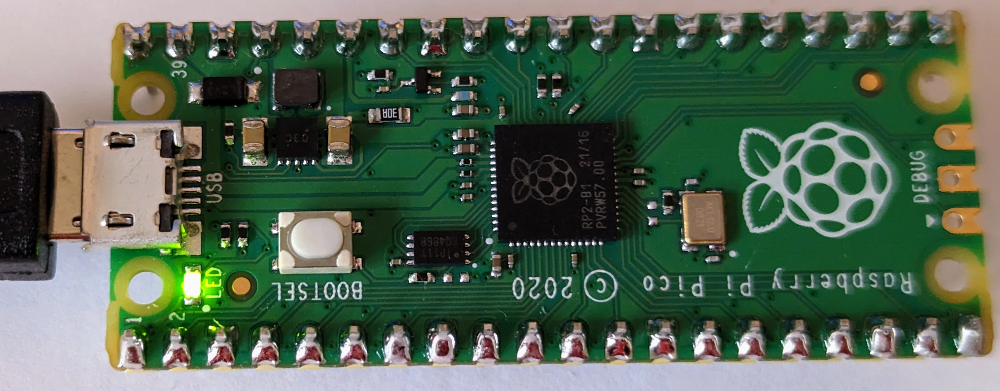

# Lesson #2: Blinky Light
## Introduction to the wiring and programming your Raspberry Pi Pico 

#### What you will need:
 - Raspberry Pi Pico
 - Breadboard
 - 4 Wires
 - 3 Resistors
 - 3 LEDs

#### Objectives
 - Make the onboard LED blink
 - Connect the Pico to three LEDs via a breadboard
 - Blink the three LEDs in sequence
 - Get creative with your code<br><br>

### Video Walk-through
In addition to the reading below, you can watch this [video](docs/videos/Lesson2.mp4?raw=true) for guidance!
<br><br>

## Steps

## Become familiar with the Raspberry Pi Pico

This is the top of the Pico. Notice the small LED in the top right corner of the board and the micorUSB connector on the right side. The first part of this lesson will blink the small LED. 


This is the bottom of the Pico. Notice that all of the pins are labeled. However, when the Pico is plugged into a breadboard this poses a problem because you can't easily read the pins.


This makes a pinout diagram incredibly helpful. It's recommended to have this pinout diagram on-hand, either printed out or easily available in your computer. The pinout diagram shows bothy logical (for example, GP11) and physical (for example, 15) pin layouts.



## Blink the Onboard LED

The steps in this section will result in the onboard LED blinking. The code example for this lesson is located in [./src/main.py](./src/main.py).

The code will blink the onboard LED. Take some time to read the comments in this code so you understand what is happening, this will help you later in the lesson. In Python, comments are marked with a '#'.

1. Using Thonny, open the `main.py` file in [./src/main.py](./src/main.py). You will choose _This Computer_ and search for the directory of this project.

   Take some time to read the comments in this code so you understand what is happening, this will help you later in the lesson. In python, comments are marked with an '#'.

1. Run the script.

    

Below is a picture of the LED when it is on, it isn't very bright.



## Blink an External LED

Next we will connect the Pico to a breadboard, an LED, and a resistor. We will then blink the LED in a similar way to the onboard LED section above.

### Attaching the Pico to the Breadboard

Below is an image of a breadboard. Notice there are a number of rows marked with numbers and two sets of columns, one marked with letters and another with a `+` (plus) a `-` (minus) sign. Also notice there is a central lane separating the two halves of the breadboard.  

All of the holes in the column with a `+` are connected and all of the holes in the column with the `-` are connected. This allows us to provide power or ground to any pin or connected device. The middle matrix of rows/columns marked with numbers/letters are connected differently. Each numbered row on each side of the center lane is connected as well.


Next you should insert the Pi Pico into the breadboard as in the image below, with the first pins of the Pi in row 1 of the breadboard. Make sure the Pi straddles the center lane so that each pin in connected indepentedly. 

> :warning: **Ensure placement of Pico**  
If you were to connect all of the pins on the same side of the board, the Pi would be damaged/destroyed since pins would be connected to each other.  

Be gentle with the Pi so you don't bend/break it as you insert it into the breadboard, but it may be VERY difficult to get it to seat fully. Ask for some help if you need it, but you need to ensure the Pi is fully seated into the breadboard.


Next, let's wire an LED to the Pi Pico using the breadboard, a resistor, jumper cables, and an LED.

### Connecting an LED, Resistor, and Wiring

Below is an LED (Light Emitting Diode). Notice that one leg of the LED is longer than the other. The longer leg is the positive (`+`) side and the shorter leg is the negative (`-`) side. This is important to remember. Wiring the LED backward wil not allow it to light up, or potentially destroy it.


You will also need a resistor which is pictured below. The more resistance provided by the resistor, the less current is allowed to flow to the LED. More current means a brighter light, less current means a dimmer light. If you were to skip the resistor (or use one with too little resistance), you will damage both the LED and the Pi because the LED would get more current than it can handle and the Pi would be sending more current than it can support through that pin. The resistor is important to protect the circut from overloading. 

Notice the colored bands on the resistor. These colored bands indicate the amount of resistance that will be provided. You can decode the bands using online resitor color code calculators like [this one](https://circuitdigest.com/calculators/5-band-resistor-color-code-calculator). For our needs we will use a resistor that is between 220 and 330 Ohms. The resistor pictured below is 330 Ohms and has band colors **Orange, Orange, Black, Black, Brown**.


Ok, let's wire up the breadboard with the LED and resistor!

You'll probably notice that you can't see the pin numbers on the Pi once you have the it seated in a breadboard. Remember the Raspberry Pi Pico pinout diagram we referenced earlier? Now is a great time to have that image on hand (either printed out, or easily referencable on your computer).

First, we need to connect one of the `GND` (ground) pins to the negative (`-`) bar on the breadboard. In our example we use physical pin `38` (row 3 on the right side of your breadboard). You simply need to insert a wire in one of the holes in the same row as PIN 38 and then to any hole in the negative bar on the breadboard. In the image below, this is the black wire. This will enable us to gound our circuiut later.

Next, connect a resistor to physical pin `15` (row 15 on the left side of the breadboard) and another free row below the Pi Pico. In our example we use row `26`.

Next, connect the positive (`+`) side of your LED to the resistor via the breadboard by inserting the long leg of the LED into another hole on the same row you just connected the resistor. If following along with our example this would be row `26`. The negative side (`-`) of the LED shall be connected across the middle of the breadboard in the same row.

> :information_source: **Wiring the LED across the center of the board**  
Wiring the LED to cross the middle of the breadboard isn't required. However, it's best practice to keep your circuit flowing from the left side to the right side of the breadboard.

Next, you'll need to ground the negative (`-`) leg (the short side) of the LED to the negative (`-`) bar on the breadboard by using another wire. In the image below, this is the white wire.

Congratulations, you have created your first complete circuit! In the next step we'll write some code to make the LED blink.


## Adjusting Our Code to Blink One External LED

The code we used to blink the onboard LED can also be used to blink an external LED. The primary difference being, we instruct the Pi Pico to adjust its current based on the location of where our LED is connected.

Referencing our code from before, edit line `8` and replace the value of 25 with `11`.

> :information_source: **Physical pins versus logical pins and effectively using your pinout diagram**  
You might be asking "but I connected my wire to the physical pin location of `15`, why would I write the value of `11` in my code?" Again, reference your Raspberry Pi Pico pinout diagram. Notice the physical pin has a reference to it called `GP11`. GP, or General Purpose I/O pins, are used by microcontrollers for general input and output operations. Each micorocontroller has unique pinout diagrams with individual pin functionalities. These become incresingly important in later lessons.

The full code can be referenced below.

```python
from machine import Pin
import time

led = Pin(
    11, # Adjusted to send current to th external LED connected at physical pin 15 (GPIO pin 11)
    Pin.OUT)

while True:
    led.toggle()
    time.sleep(1)
```

## Blink Three External LEDs

Using the same principles you learned above, wire two more LEDs by connecting them to physical pin `16` (`GP12`) and physical pin `17` (`GP13`). The image below is what the final circuit shall look like. 

> :warning: **Be careful that none of the resistor or LED wires are touching each other**


Again, referencing our source code from before, let's make a few modifications to blink all three connected LEDs.

Let's start by creating individual variables for each of the LEDs we just wired based on their color and location. Delete lines `6-9` and replace it with the following code snippet. Double check the pin values match the GP location in your pinout diagram for each.

```python
red_led = Pin(11, Pin.OUT)
yellow_led = Pin(12, Pin.OUT) 
green_led = Pin(13, Pin.OUT)
```

Now, let sequentially turn the LEDs on, then off, in turn. First, delete lines `11` and `12`. Use the following code block to toggle the LEDs on then off with a 1 second delay between each.

```python
    green_led.on()
    time.sleep(1)
    green_led.off()

    yellow_led.on()
    time.sleep(1)
    yellow_led.off()

    red_led.on()
    time.sleep(1)
    red_led.off()

    time.sleep(1)  
```

Your final code should look like this:

```python
from machine import Pin
import time

red_led = Pin(11, Pin.OUT)
yellow_led = Pin(12, Pin.OUT) 
green_led = Pin(13, Pin.OUT)

while True:
    green_led.on()
    time.sleep(1)
    green_led.off()

    yellow_led.on()
    time.sleep(1)
    yellow_led.off()

    red_led.on()
    time.sleep(1)
    red_led.off()

    time.sleep(1)  
```

**Congratulations! You have successfully completed Lesson 2.**
<br><br>

## Want more?
If you have finished with the base lesson, check out the items below.

* Use a single variable to manage timing for your LEDs.
* Modify your code to make the LEDs blink every half a second.
* Modify your code to reverse the order that the LEDs blink.

## Challenge 
Modify your code to use a For Loop to iterate through each of the three LEDs and turn them on/off in sequence.

This challenge will introduce you to the [Python For Loop](https://www.w3schools.com/python/python_for_loops.asp). By using a For Loop, you can simplify your code by reducing duplication. In general programming this concept is often referred to as "DRY" (Don't Repeat Yourself).

A successful implementation of this code will result in the following:
* Minimal duplication of code. Ideally no duplication.
* Each LED will blink in a sequence. For example, Red -> White -> Blue -> Repeat.

As you think through using a For Loop, consider the location of your wiring. Is each one of your three LEDs wired to sequential pins on your Pico? If not, how might you solve for this?

<details>
<summary>Expand to see an example using a For Loop to minimize code duplication</summary>

```python
from machine import Pin
import time

while True:
    for x in range(11,24): # The LEDs were wired to GP pins 11, 12, and 13 in this example.
        led = Pin(x, Pin.OUT)
        led.on()
        time.sleep(1)
        led.off()
```
</details>

## Toubleshooting
Watch the walk-through [video](docs/videos/Lesson2.mp4?raw=true) for guidance!

LEDs not lighting up? Double check the wiring. Then, be sure the values you have defined in your code map to the `GP` pin locations on your Pi Pico. Remember, the physical pin location of the microcontroller is not the same as the logical usage of the pins themselves. Reference your pinout diagram as needed.

Also, your Pi Pico will remember the state of its onboard LED from the last time the onboard LED was used. This means if your LED was OFF and you stop, or unplug the Pico, it will remember the LED being OFF next time you plug it in. Similarly this applies to if the LED was ON.
