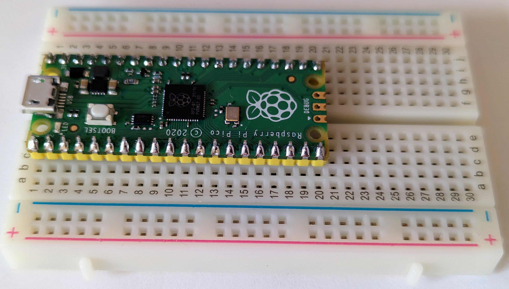
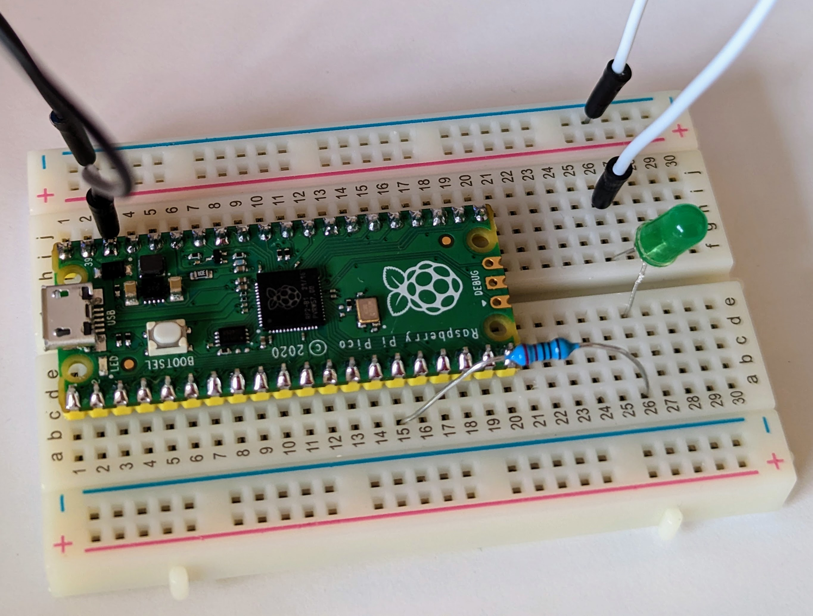

# Lesson #2: Blinky Light
## Introduction to the wiring and programming your Raspberry Pi Pico 

#### What you will need:
 - Raspberry Pi Pico
 - Breadboard
 - 4 Wires
 - 3 Resistors
 - 3 LEDs

#### Objectives
 - Make the onboard LED blink
 - Connect the Pico to three LEDs via a breadboard
 - Blink the three LEDs in sequence
 - Get creative with your code<br><br>

### Video Walk-through
In addition to the reading below, you can watch this [video](videos/Lesson2.mp4?raw=true) for guidance!
<br><br>

## Steps

## Become familiar with the Raspberry Pi Pico

This is the top of the Pico.  Notice the small LED in the top right corner of the board and the micorUSB connector on the right side.  The first part of this lesson will blink the small LED.  


This is the bottom of the Pico.  Notice that all of the pins are labeled. However, when the Pico is plugged into a breadboard this poses a problem because you can't easily read the pins.


This makes a pinout diagram incredibly helpful. It's recommended to have this pinout diagram on-hand, either printed out or easily available in your computer. The pinout diagram shows bothy logical (for example, GP11) and physical (for example, 15) pin layouts.


## Blink the Onboard LED

The following code will blink the onboard LED.  Take some time to read the comments in this code so you understand what is happening, this will help you later in the lesson.  In python, comments are marked with an '#'.

The steps in this section will result in the onboard LED blinking. The code example for this lesson is located in [./src/main.py](./src/main.py).

1. Using Thonny, open the `main.py` file in [./src/main.py](./src/main.py). You will choose _This Computer_ and search for the directory of this project.

   Take some time to read the comments in this code so you understand what is happening, this will help you later in the lesson.  In python, comments are marked with an '#'.

1. Run the script.

    

Below is a picture of the LED when it is on, it isn't very bright.


## Step 3: Wire the Breadboard

Next we will connect the Pi to a breadboard and wire an LED to one of its pins.

Below is an image of a breadboard, let's get oriented with how it works.  Notice there are a number of rows, marked with numbers and two sets of columns, one marked with letters and another with a + (plus) an - (minus) sign.  Also notice there is a central lane separating the two halves of the breadboard.  

All of the holes in the column with a + (plus) sign are connected and all of the holes in the column with the - (minus) sign are connected.  This allows us to provide power or ground to any pin/device.  The middle matrix of rows/columns marked with numbers/letters are connected differently.  Each numbered row on each side of the center lane is connected as well.


Next you should insert the Raspberry Pi into the breadboard as in the image below, with the first pins of the Pi in row 1 of the breadboard.  Make sure the Pi straddles the center lane so that each pin in connected indepentedly.  If you were to connect all of the pins on the same side of the board, the Pi would be damaged/destroyed since pins would be connected to each other.  

Be gentle with the Pi so you don't bend/break it as you insert it into the breadboard, but it may be VERY difficult to get it to seat fully.  Ask for some help if you need it, but you need to ensure the Pi is fully seated into the breadboard.



Next, let's wire an LED to the Pi using the breadboard.  You will need a single LED and a resistor, let's learn about both of them first.  

Below is an LED (Light Emitting Diode).  Notice that one leg of the LED is longer than the other.  The longer leg is the positive (+) side and the shorter leg is the negative (-) side.  This is important to remember.  Wiring the LED backward wil not allow it to light up (and could destroy it).


You will also need a resistor, which is pictured below.  The more resistance provided by the resistor, the less current is allowed to flow to the LED.  More current means a brighter light, less current means a dimmer light.  If you were to skip the resistor (or use one with too little resistance), you will damage both the LED and the Pi because the LED would get more current than it can handle and the Pi would be sending more current than it can support through that pin.  The resistor is important to protect the circut from overloading.  

Notice the colored bands on the resistor, these indicate the amount of resistance that will be provided.  It is admittedly a pretty cryptic system, but resistors are small so it is what it is.  You can decode the bands using online resitor color code calculators, like [this one](https://circuitdigest.com/calculators/5-band-resistor-color-code-calculator).  For our needs we will use a resistor that is between 220 and 330 Ohms.  The resistor pictured below is 330 Ohms and has band colors Orange, Orange, Black, Black, Brown.


Ok, let's wire up the breadboard with the LED and resistor!

You'll probably notice that you can't see the pin numbers on the Pi once you have the it seated in a breadboard, which is unfortunate.  You can refer to a pinout chart like the one pictured below to help line things up.  Make sure you are looking at the correct side of the Pi depending on whether the chart is referencing the top or bottom of the board, but the example below is oriented as you see the Pi on your breadboard. 


First, we need to connect one of the GND ("ground") pins to the negative (-) bar on the breadboard.  I used PIN 38 (which should be in row 3 on the right side of your breadboard).  You simply need to insert a wire in one of the holes in the same row as PIN 38 and then to any hole in the negative bar on the breadboard.  In the image below, this is the black wire.  This will enable us to gound our circuiut later.

Next, connect a resistor to PIN 11 (which should be row 15 on the left side of the breadboard) and another free row below the pi, in the image you'll see I used row 26.

Next, connect the positive (+) side of your LED to the resistor, through the breadboard, by inserting the long leg of the LED into another hole on the same row you just connected the resistor (row 26 in my exmaple).  The negative side (-) of the LED should be connected to a free row on the other side of the breadboard (I stuck with row 26 on that side too).  (Note: Technically, it doesn't HAVE to be on the other side of the breadboard, it just needs to be in it's own row.  However, it's best practice to keep your circuit flowing from the left side to the right side of the breadboard).

Next, you'll need to ground the negative (-) leg (the short side) of the LED to the negative (-) bar on the breadboard by using another wire.  In the image below, this is the white wire.

**Congratulations, you have created your first complete circuit!!**  In the next step, we'll write some code to make the LED blink.



## Step 4: Blink the External LED

The following code will blink the LED we wired up (assuming you used all the same PINs as I did).  Take some time to read the comments in this code so you understand what is happening.  

```python
from machine import Pin  # This imports the libraries needed for us to access the Pico and it's pins
import time # the time library will enable us to use the sleep method

# The next few lines creates and initializes a variable "led" as type "Pin" with initialization parameters.  It can also be written in one line like this... led = Pin(15, Pin.OUT)
led = Pin( # Initialize a variable called "led" as a "Pin" object
    11, # Assign pin number 11 (or whichever pin you connected the LED to)
    Pin.OUT) # Specify this is an output pin, meaning we will send data to the pin vs recieving data from it

while True: # A while loop will run until the argument is no longer true.  In this case, True will always be true so it will run forever until we forcefully stop the program
    led.toggle() # call the "toggle()" function of the led object
    time.sleep(1) # call the sleep() function of the time object and pass it "1" so it sleeps for 1 second
```

Load and run [BlinkOneLEDwithLoop.py](code/BlinkOneLEDwithLoop.py) on the Pi and the external LED should blink.

## Step 5: Wire Three LEDs

Using the same principles you learned above, wire two more LEDs, connecting them to PIN 12 and PIN 13.  The image below is what the final circuit should look like.  Be careful that none of the resistor or LED wires are touching each other, it can get pretty crowded on the breadboard.


## Step 6: Blink the LEDs

The following code will blink the LEDs we wired up in sequence (assuming you used all the same PINs as I did).  Take some time to read the comments in this code so you understand what is happening.  

```python
from machine import Pin  # This imports the libraries needed for us to access the Pico and it's pins
import time  # the time library will enable us to use the sleep method

# Create variables for each LED, initializaing them to the pins they are connected to   
redled = Pin(11, Pin.OUT)
yellowled = Pin(12, Pin.OUT) 
greenled = Pin(13, Pin.OUT)

# Create a variable to control how long the LED will stay on, in seconds
timerPeriod = 1

while True:  # A while loop will run until the argument is no longer true.  In this case, True will always be true so it will run forever until we forcefully stop the program
    greenled.on()  # Turn the green LED on
    time.sleep(timerPeriod)  # Sleeping now will keep the LED on for the period specified by the variable you created ealier
    greenled.off()  # Turn the green LED off
    # what line of code would you add here to keep the LED off for a specified period?
    yellowled.on()  # Turn the yellow LED on
    time.sleep(timerPeriod)  
    yellowled.off()  
    redled.on()  
    time.sleep(timerPeriod) 
    redled.off()  
    time.sleep(timerPeriod)  
    
```

Load and run [BlinkThreeLEDs.py](code/BlinkThreeLEDs.py) on the Pi and the LEDs should blink in sequence.

#### Challenge: Modify your code to make the LEDs blink every half a second.
#### Challenge: Modify your code to reverse the order that the LEDs blink

## Step 7: Celebrate Your Success!

Congratulations, you have succesfully wired a Raspberry Pi Pico to a breadboard with external LEDs, learned what resistors do, and wrote code to control your device.  In the next lessons, you will learn how to add sensors to your circuit, read data from them, and store and analyze that data for later study.    


## Need help?
Watch the walk-through [video](videos/Lesson2.mp4?raw=true) for guidance!

<details>

<summary>Tips for collapsed sections</summary>

### You can add a header

You can add text within a collapsed section. 

You can add an image or a code block, too.

```ruby
   puts "Hello World"
```

</details>
