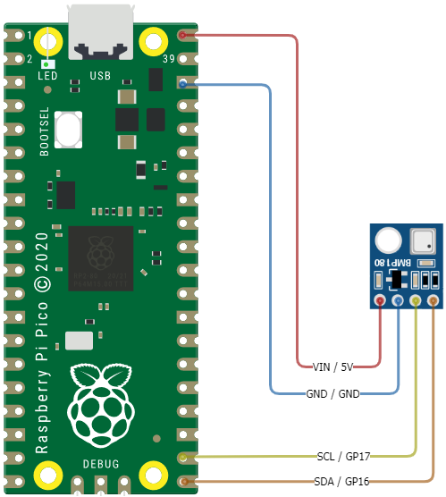
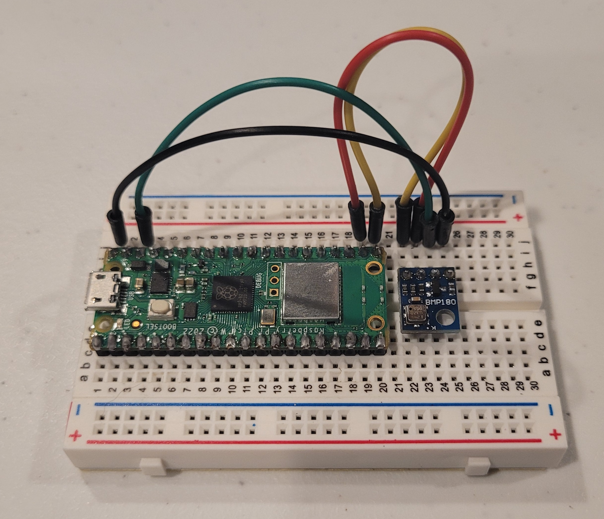
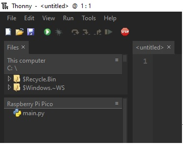
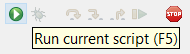

# Lesson 3: Temperature, Pressure, and Altitude
## High Altitude Balloon Data Logging

### Pre-requisites
* Complete [Lesson 1: Blinking Light](../lesson1/README.md)
* [Thonny Python IDE](https://thonny.org/) installed on your computer
* All necessary hardware components (Raspberry Pi Pico, BPM-180 module, breadboard, wires, USB cable, computer)

### Objectives
* Use breadboard to wire BMP-180 module to Raspberry Pi Pico
* Install the BPM-180 MicroPython driver to the Raspberry Pi Pico
* Print temperature, pressure, and altitude to the console

### Results
* Familiarity with wiring a breadboard
* Understanding of basic MicroPython code
* Learn the importance of MicroPython drivers and how to use them
* A functioning program for reading temperature, pressure, and altitude using the BMP-180<br><br>

### Video Walk-through
In addition to the reading below, you can watch this [video](docs/videos/Lesson3.mp4?raw=true) for guidance!
<br><br>

## Steps

  **IMPORTANT** Before wiring your Pico, UNPLUG IT FROM YOUR COMPUTER. If plugged in while wiring, you risk damaging the Pico or BMP-180 module.

1. Wire the BMP-180 to the Raspberry Pi Pico.
    BMP-180 Pins | Description | Pi Pico Pins
    ------------ | ----------- | ------------
    VIN          | (Voltage In): Provides power to the BMP-180. Connect to the 5V pin on Pico | 5V (40)
    GND          | (Ground): Connect to the ground pin on Pico | GND (38)
    SCL          | (Serial Clock): Accepts clock pulses from the Pico to synchronize data transmission | GP17 (22)
    SDA          | (Serial Data): Used for data exchange | GP16 (21)

    

    

### Install BMP-180 Driver

Drivers are code modules for enabling certain functionality. One such driver allows us to read data from the BMP-180 module. This driver is called `bmp180.py` and is located in the [../drivers/src/bmp180.py](../drivers/src/bmp180.py) location. The following steps will result in saving this driver to the Raspberry Pi Pico so the driver can be used by our Python code.

1. Download the driver called `bmp180.py` located in the [../drivers/src/bmp180.py](../drivers/src/bmp180.py) location.

1. Connect your Raspberry Pi Pico to your computer using the USB cable.

1. Open the Thonny IDE. _Stop/Restart_ the backend to refresh the connection.

    

    You should now see `Raspberry Pi Pico` displayed in the left-hand navigation of Thonny. If the "Files" window is not displaying add it from the View > Files menu.

    

1. If one does not already exist, create a new directory in Thonny on the Raspberry Pi Pic called `drivers`.
    
    

1. Using Thonny, select _File_ then _Open_ from the menu. Choose _This Computer_. Navigate to the location where you downloaded `bmp180.py` in a previous step. Select the file and click _Open_.

1. Save the `bmp180.py` file to the Raspberry Pi Pico. This allows our code to use the driver to perform BMP-180 actions in MicroPython when running on the Pi Pico. 

    Click _File_ then _Save as..._. Choose _Raspberry Pi Pico_. Double-click the `drivers` folder created in a previous step. Then save the `bmp180.py` file being sure to name it `bmp180.py`.

1. If a file called `__init__.py` does not already exist in the `/drivers` folder, create a new file in Thonny called `__init__.py`. 

    Click _File_ then _New_. Then click _File_ then _Save as..._. Choose _Raspberry Pi Pico_ and save this empty file to the same `drivers` location as the previous step. Name the file `__init__.py`. This empty file is used by Python to indicate the `drivers` folder is to be used for Python modules.

    Your finished folders and files should look like this:<br>
    

### BMP-180 Program

The steps in this section will use the previous hardware and driver sections to allow reading temperature, pressure, and altitude from the BMP-180 module. The code example for this lesson is located in [./src/main.py](./src/main.py).

1. Using Thonny, open the `main.py` file in [./src/main.py](./src/main.py).

1. Run the script.

    

    Output will be generated to the console in Thonny describing the actions being taken. You will see output for the temperature, pressure, and altutide captured by the BMP-180.

    Example output:

    ```
    Temperature (C):	 21
    Pressure (Pa):  	 98420
    Altitude (m):   	 232
    ```

**Congratulations! You have successfully completed Lesson 3.**
<br><br>

## Want more?
If you have finished with the base lesson, check out the items below.
<br><br>

Update the code to do any/all of the following:
* Add the units of measurement to the end of the output
* Convert the temperature to degrees Fahrenheit (or Kelvin 🥶)
* Convert the pressure to inches of mercury or atmospheres
* Convert the altitude to feet (or furlongs 🤔)
* Create a function for unit conversions to pass variables and print output.

Things to think about, validate, and/or try:
* How can you change the temperature surrounding the BMP180 (Don't touch it 😅)
* What should the pressure reading be?
* Is the altitude correct? 
* How sensitive is the reading?

## Challenge 
Modify your code to use a function to initialize the BPM180 module.

This challenge will introduce you to using  [Python Functions](https://www.w3schools.com/python/python_functions.asp). Using functions can simplify your code, offer greater readability, and align to the "DRY" (Don't Repeat Yourself) concepts mentioned in earlier challenges. A good function is one with an obvious name based on its action and with predictable inputs and outputs. For example, a function named `multiply_integer_by_10` would likely take in an integer, multiply it by 10, and output the result.

A successful implementation of this code will result in the following:
* Actions related to initiatlizing the BMP180 module will be contained in a function.
* Inputs for this function will be the `GP` pin locations for `SCL` and `SDA`.
* The output of this function will be a BMP180 object we use later in our code to extract measurements.

As you think through introducing this function into your code, think about how this same function can be used in later lessons. If the function is re-usable, can it be shared across more of our code base? Is the function "obvious" in its intent and what it outputs?

<details>
<summary>Expand to see an example using a Function to initialize the BMP180 module</summary>

```python
from machine import Pin, I2C
from drivers import bmp180
import time

def initialize_bmp180_module(scl_pin_location, sda_pin_location):
    # Initialize I2C using available I2C pins
    bus =  I2C(0,
               scl=Pin(scl_pin_location), # take SCL as input into the function and use it here
               sda=Pin(sda_pin_location), # take SDA as input into the function and use it here
               freq=100000)
    
    # Initialize BMP180 with previously defined I2C config
    new_bmp180 = bmp180.BMP180(bus) # Create a new bmp180 object.
    
    new_bmp180.oversample_sett = 2 # Accuracy, as defined in driver docs: https://github.com/micropython-IMU/micropython-bmp180
    new_bmp180.baseline = 101325   # Baseline pressure, as defined in driver docs: https://github.com/micropython-IMU/micropython-bmp180

    return new_bmp180 # return the bmp180 object. Once returned, we assign the object to a new value in our main function

if __name__ == "__main__" :
    # Main entrypoint. Primary code functions start here.
    
    bmp180 = initialize_bmp180_module(17,16) # initialize the BMP180 using our function.
                                             # Assign it to a variable of your choosing. In this example we call it `bmp180`
    
    while True:
        temp = bmp180.temperature  # Capture temperature, assign to `temp` variable
        p = bmp180.pressure        # Capture pressure, assign to `p` variable
        altitude = bmp180.altitude # Capture altitude, assign to `altitude` variable
        
        # Print results to console
        print("Temperature (C):\t %d" % temp)
        print("Pressure (Pa):  \t %d" % p)
        print("Altitude (m):   \t %d" % altitude)
        print("")
        time.sleep(1)
```
</details>

## Troubleshooting

* `ERROR: No module named (drivers, bmp180, ...)`
    
    If you see this error it means Python is not able to locate a module to be imported. This can occur because the version of MicroPyhon you are using does not support the module you are trying to import. Specifically for this lesson it likely applies to the `drivers` step. Ensure the `drivers` folder and its contents, `bmp180.py` and `__init__.py`, are saved to the Raspberry Pi Pico device and _not_ your computer.

    Example error message:
    ```sh
    Traceback (most recent call last):
      File "<stdin>", line 2, in <module>
    ImportError: no module named 'drivers'
    ```

* `OSError: [Errno 5] EIO`

    If you see this error it means you likely have incorrect or loose wiring. Double-check the location of your wires whether those wires are loose.

    Example error message:

    ```
    Traceback (most recent call last):
      File "<stdin>", line 15, in <module>
      File "drivers/bmp180.py", line 48, in __init__
    OSError: [Errno 5] EIO
    ```

* `OValueError: bad [SCL | SDA] pin`

    If you see this error it means you likely have incorrectly defined your SCL or SDA pin location in your code. You may have your module wired to a location on your Pico, but define the GP pins in your code to point to a different location. Verify your code matches with the `GP` pin locations in your Pi Pico pinout diagram.

    Example error message:

    ```
    Traceback (most recent call last):
      File "<stdin>", line 11, in <module>
    ValueError: bad [SDA | SCL] pin
    ```

## Reference Material
* [Raspberry Pi Pico Pinout](https://datasheets.raspberrypi.com/pico/Pico-R3-A4-Pinout.pdf)
* [Raspberry Pi Pico SDK](https://datasheets.raspberrypi.com/pico/raspberry-pi-pico-python-sdk.pdf)
* [MicroPython-IMU BMP-180 Driver source code](https://github.com/micropython-IMU/micropython-bmp180)
<br><br>

## Need help?
Watch the walk-through [video](docs/videos/Lesson3.mp4?raw=true) for guidance!
