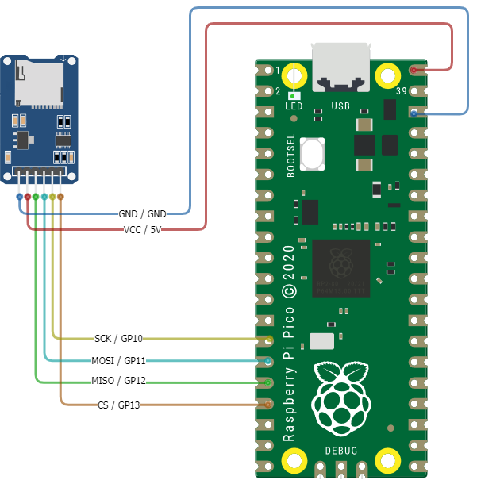
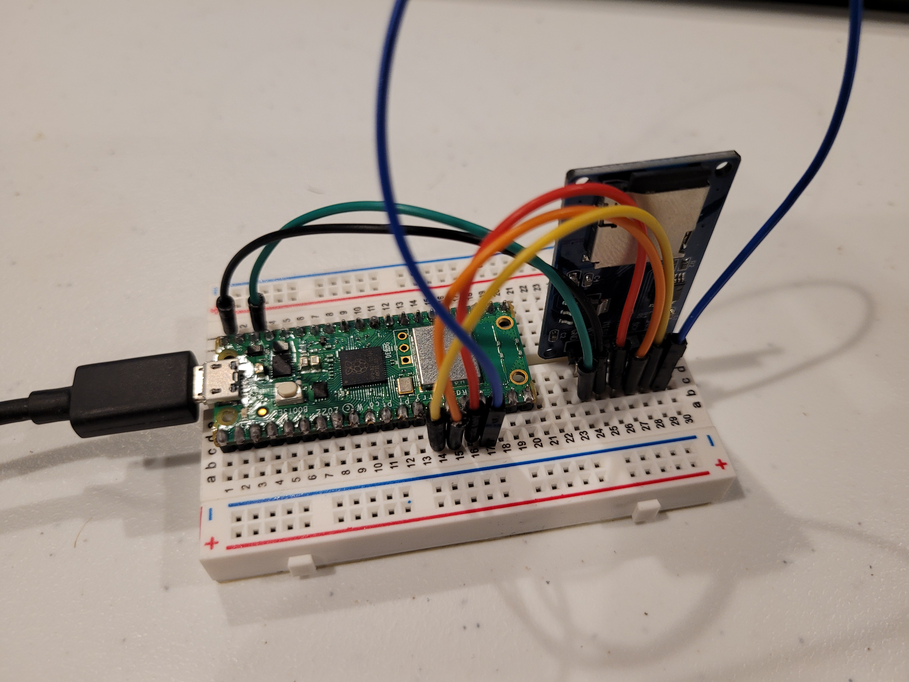
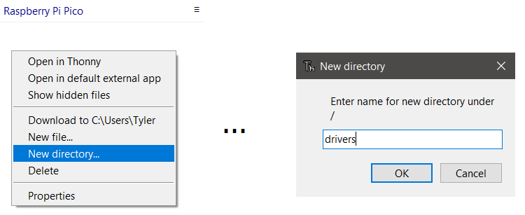

# Lesson 5: Writing Data to SD Card Module
## High Altitude Balloon Data Logging

### Pre-requisites
* Complete [Lesson 1: Blinking Light](../lesson1/README.md)
* [Thonny Python IDE](https://thonny.org/) installed on your computer
* A FAT32 formatted micro SD card 32GB or less. Use [How to Format SD Card on Mac, Windows, Android and Camera](https://www.cisdem.com/resource/how-to-format-sd-card.html) as a guide.
* All necessary hardware components (Raspberry Pi Pico, HW-125 SDCard module, breadboard, wires, USB cable, computer)

### Objectives
* Use breadboard to wire SD Card module to Raspberry Pi Pico
* Install a MicroPython driver to the Raspberry Pi Pico
* Write test data to CSV file stored on the SD Card
* Read test data stored on the SD Card
* Delete test data from SD Card

### Results
* Familiarity with wiring a breadboard
* Understanding of basic MicroPython code
* Learn the importance of MicroPython drivers and how to use them
* A functioning program for storing data on an SD card connected to the Raspberry Pi Pico

### Video Walk-through
In addition to the reading below, you can watch this [video](./docs/videos/Lesson5.mp4?raw=true) for guidance!
<br><br>

 ## Steps

 ### Hardware Configuration and Wiring

 **IMPORTANT** Before wiring your Pico, UNPLUG IT FROM YOUR COMPUTER. If plugged in while wiring, you risk damaging the Pico or SDCard reader.

1. Wire the HW-125 SDCard reader to the Raspberry Pi Pico.
    HW-125 Pins | Description | Pi Pico Pins
    ----------- | ----------- | ------------
    GND         | (Voltage Common Collector): Provides power to the HW-125. Connect to the 5V pin on Pico | GND (38)
    VCC         | (Ground): Connect to the ground pin on Pico | 5V (40)
    SCK         | (Serial Clock): Accepts clock pulses from the Pico to synchronize data transmission | GP10 (14)
    MOSI        | (Master Out Slave In): SPI input to microSD card module | GP11 (15)
    MISO        | (Master In Slave Out): SPI output from the microSD card module | GP12 (16)
    CS          | (Chip Select): Control pin used to select one (or set) of devices on the SPI bus | GP13 (17) 

    

    Finished wire up:
    

1. Format the micro SD card as `FAT32`. Use [How to Format SD Card on Mac, Windows, Android and Camera](https://www.cisdem.com/resource/how-to-format-sd-card.html) as a guide.

> :information_source: **Partition larger SD card to 32GB**  
If you do not have a 32GB card you can [partition](./docs/images/sdCardFormat.gif) a larger card down to 32GB and it will work as well. Be cautious in using Disk Formatter because you can accidentally reformat any attached storage device to your computer. **Double check you have selected the SD card you want to format**.

### Install SD Card MicroPython Driver

Drivers are code modules for enabling certain functionality. One such driver allows us to read data from the SD Card module. This driver is called `sdcard.py` and is located in the [../drivers/src/sdcard.py](../drivers/src/sdcard.py) location. The following steps will result in saving this driver to the Raspberry Pi Pico so the driver can be used by our Python code.

1. Download the driver called `sdcard.py` located in the [../drivers/src/sdcard.py](../drivers/src/sdcard.py) location.

1. Connect your Raspberry Pi Pico to your computer using the USB cable.

1. Open the Thonny IDE. _Stop/Restart_ the backend to refresh the connection.

    

    You should now see `Raspberry Pi Pico` displayed in the left-hand navigation of Thonny.If the "Files" window is not displaying add it from the View > Files menu.

    

1. If one does not already exist, create a new directory in Thonny on the Raspberry Pi Pic called `drivers`.
    
    

1. Using Thonny, select _File_ then _Open_ from the menu. Choose _This Computer_. Navigate to the location where you downloaded `sdcard.py` in a previous step. Select the file and click _Open_.

1. Save the `sdcard.py` file to the Raspberry Pi Pico. This allows our code to use the driver to perform SD card actions in MicroPython when running on the Pi Pico. 

    Click _File_ then _Save as..._. Choose _Raspberry Pi Pico_. Double-click the `drivers` folder created in a previous step. Then save the `sdcard.py` file being sure to name it `sdcard.py`.

1. If a file called `__init__.py` does not already exist in the `/drivers` folder, create a new file in Thonny called `__init__.py`. 

    Click _File_ then _New_. Then click _File_ then _Save as..._. Choose _Raspberry Pi Pico_ and save this empty file to the same `drivers` location as the previous step. Name the file `__init__.py`. This empty file is used by Python to indicate the `drivers` folder is to be used for Python modules.

     Your finished folders and files should look like this:<br>
    

### SD Card Reader/Writer Program

The steps in this section will use the previous hardware and driver sections to allow writing to, and reading from a CSV file. The code example for this lesson is located in [./src/main.py](./src/main.py).

1. Using Thonny, open the `main.py` file in [./src/main.py](./src/main.py).

1. Run the script.

    

    Output will be generated to the console in Thonny describing the actions being taken. You will also see a new directory created on the SD card called `/sd` if using the example code. Within this folder is a called called `data.csv`. You may choose to download this file to your computer and open the file using a program such as Microsoft Excel to read the data in a more familiar program.

    


**Congratulations! You have successfully completed Lesson 5.**

<br>

## Want more?
If you have finished with the base lesson, check out the items below.
<br><br>

Update the code to do any/all of the following:
1. Write your own custom output to the file and change the filename
1. Use a loop to write the even numbers from 0 to 100 into the file 😵

Things to think about, validate, and/or try:
* How big is the file?
* Is CSV the best output format?
* How long before we run out of space on the SD card? 🤔

## Challenge 
Create a function to delete contents on the SD card

A successful implementation of this code will result in the following:
* A new function called `delete_files_from_sdcard_folder`
* This function will take in a folder name and delete all the contents in that folder
* The function will print status information to inform the user of actions being taken
* The function may implement the use of Try Except to handle exceptions

As you think through this code, also consider previous challenges in lessons that introduce concepts of Python Functions and Python Try Except blocks for exception handling.

<details>
<summary>Expand to see an example function to delete folder contents from the SD card</summary>

You may choose to add this code to your `main.py` as a means to clear contents from the SD card.

```python
from machine import Pin, SPI
from drivers import sdcard

import os

def delete_files_from_sdcard_folder(folder):
    """Delete all files from SD Card folder"""

    print("Deleting files in %s" % folder)
    for file in os.listdir(folder):
        try:
            os.remove(folder + '/' + file)
        except Exception as e:
            pass
    print("Done.\n\n")


if __name__ == "__main__":
    # Main entrypoint. Primary code functions start here.
    
    sd_dir = '/sd' # Directory created on SD card at root '/'. Expected format is '/<string>'. Example: '/sd'

    # Intialize SPI peripheral
    spi = machine.SPI(1,
                      baudrate=1000000,     # 1 MHz
                      polarity=0,
                      phase=0,
                      bits=8,
                      firstbit=SPI.MSB,
                      sck=machine.Pin(10),  # Pico GPIO Pin 10
                      mosi=machine.Pin(11), # Pico GPIO Pin 11
                      miso=machine.Pin(12)) # Pico GPIO Pin 12

    # Initialize the SD card to Pico GPIO Pin 13 on chip select (CS) pin
    sd = sdcard.SDCard(spi,Pin(13))
    
    delete_files_from_sdcard_folder(sd_dir) # Uncomment this line to run a function to delete all the files
                                            # in the folder location passed in.
     
```
</details>

## Troubleshooting

* `ERROR: No module named (drivers, sdcard, ...)`
    
    If you see this error it means Python is not able to locate a module to be imported. This can occur because the version of MicroPyhon you are using does not support the module you are trying to import. Specifically for this lesson it likely applies to the `drivers` step. Ensure the `drivers` folder and its contents, `sdcard.py` and `__init__.py`, are saved to the Raspberry Pi Pico device and _not_ your computer.

    Example error message:
    ```sh
    Traceback (most recent call last):
      File "<stdin>", line 2, in <module>
    ImportError: no module named 'drivers'
    ```
* Validate the SD card is 32GB or smaller and formatted to FAT32
  * [How to Format SD Card on Mac, Windows, Android and Camera](https://www.cisdem.com/resource/how-to-format-sd-card.html)
  * [partitioning a larger SD card to 32GB](./docs/images/sdCardFormat.gif)

## Reference Material
* [How to Format SD Card on Mac, Windows, Android and Camera](https://www.cisdem.com/resource/how-to-format-sd-card.html)
* [Raspberry Pi Pico Pinout](https://datasheets.raspberrypi.com/pico/Pico-R3-A4-Pinout.pdf)
* [Raspberry Pi Pico SDK](https://datasheets.raspberrypi.com/pico/raspberry-pi-pico-python-sdk.pdf)
* [MicroPython releases for Pico](https://micropython.org/download/rp2-pico/)
* [MicroPython libraries](https://docs.micropython.org/en/latest/library/index.html)

## Need help?
Watch the walk-through [video](videos/Lesson5.mp4?raw=true) for guidance!
