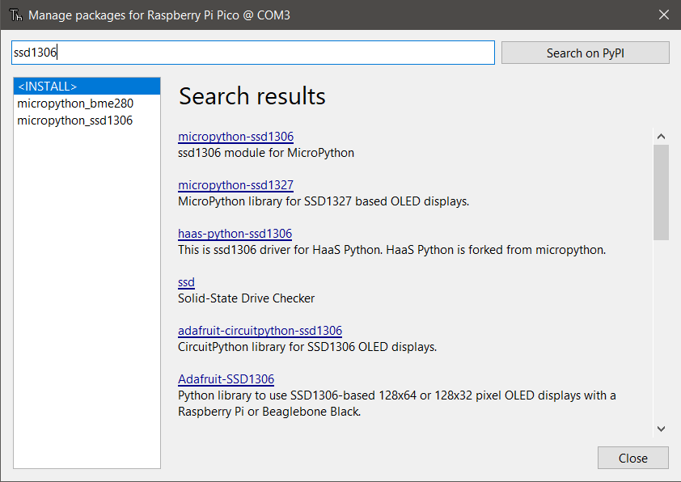

# Lesson 7: Using the OLED Module
## High Altitude Balloon Data Logging

### Pre-requisites
* Complete [Lesson 1: Blinking Light](../lesson1/README.md)
* [Thonny Python IDE](https://thonny.org/) installed on your computer
* All necessary hardware components

### Objectives
* Use breadboard to wire the OLED module to the Raspberry Pi Pico
* Install the supported library to the Raspberry Pi Pico for the OLED device
* Write code to display information on the OLED

### Results
* Installing supported MicroPython libraries using Thonny IDE
* Understanding how to interface with an I2C display device

 ## Steps

 ### Hardware Configuration and Wiring

 **IMPORTANT** Before wiring your Pico, UNPLUG IT FROM YOUR COMPUTER. If plugged in while wiring, you risk damaging the Pico or SDCard reader.

1. Wire the SSD1306 OLED display module to the Raspberry Pi Pico.
    SSD1306 Pins | Description | Pi Pico Pins
    ------------ | ----------- | ------------
    GND          | (Voltage Common Collector): Provides power to the module. Connect to the 5V pin on Pico | GND (38)
    VCC          | (Ground): Connect to the ground pin on Pico | 5V (40)
    SCL          | (Serial Clock): Accepts clock pulses from the Pico to synchronize data transmission | GP10 (17)
    SDA          | (Serial Data): Used for data exchange | GP16 (16)

    

### Install the SSD1306 Library

Some modules are supported by existing drivers, or libraries offered from within the Thonny IDE. the SSD1306 is one such module with a supported library. This makes interfacing with the device and writing your application code much easier!

1. Connect your Raspberry Pi Pico to your computer using the USB cable.

1. Open the Thonny IDE. _Stop/Restart_ the backend to refresh the connection.

    

1. Click _Tools_ then  _Manage Packages_

1. Type "ssd1306" in the search bar and click _Search on PyPi_

    

1. Select the **micropython-ssd1306** option from the search results.

1. Click _Install_. This will install the supported library for the SSD1306 OLED device.

1. Click _Close_

### Print Information to the SSD1306 OLED

The steps in this section will use the previous hardware and driver sections to write information to the SSD1306 OLED display. The code example for this lesson is located in [./src/main.py](./src/main.py).

1. Using Thonny, open the `main.py` file in [./src/main.py](./src/main.py).

1. Run the script.

    

    A message will be displayed on the OLED screen.

**Congratulations! You have successfully completed Lesson 6.**

## Reference Material
* [Tom's Hardware: How to Use an OLED Display With Raspberry Pi Pico (Updated)](https://www.tomshardware.com/how-to/oled-display-raspberry-pi-pico)