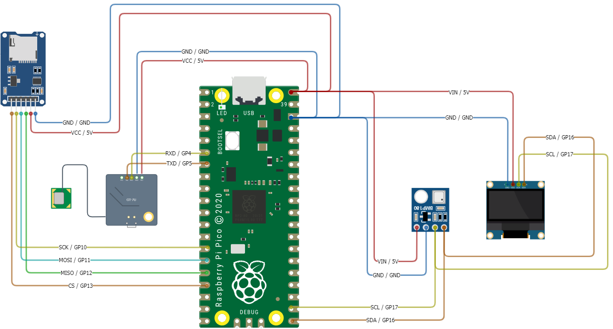

# Lesson X: Launch
## High Altitude Balloon Data Logging

### Pre-requisites
* Complete previous sensor lessons
    * [Lesson 3: Temperature, Pressure, and Altitude](../lesson-3/README.md)
    * [Lesson 4: GPS Coordinates](../lesson-4/README.md)
    * [Lesson 5: Writing Data to SD Card Module](../lesson-5/README.md)
    * [Lesson 6: Bringing It All Together](../lesson-6/README.md)
    * [Lesson 7: Using the OLED Module](../lesson-7/README.md)
* [Thonny Python IDE](https://thonny.org/) installed on your computer
* All necessary hardware components

### Objectives
* Use all previous lessons to collect data from different modules and write to SD Card.
* Perform diagnostics on individual modules and display diagnostics to OLED module.

### Results
* A field-ready prototype of all modules capable of accurately and reliably collecting data.

  

## Steps

### Hardware Configuration and Wiring

**IMPORTANT** Before wiring your Pico, UNPLUG IT FROM YOUR COMPUTER. If plugged in while wiring, you risk damaging the Pico or SDCard reader.

1. Wire all the modules into the breadboard according to the pin out below:
 BB = Bread Board
    Module/Controller Pin | Description | BB/Pi Pico Pins
    ----------- | ----------- | ------------
    ||**SD Card Module**|
    VCC         | (Voltage Common Collector): Provides power to the HW-125.  | BB Power (+)
    GND         | Ground | BB Ground (-)
    SCK         | (Serial Clock): Accepts clock pulses from the Pico to synchronize data transmission | GP10 (14)
    MOSI        | (Master Out Slave In): SPI input to microSD card module | GP11 (15)
    MISO        | (Master In Slave Out): SPI output from the microSD card module | GP12 (16)
    CS          | (Chip Select): Control pin used to select one (or set) of devices on the SPI bus | GP13 (17) 
    ||**GPS Sensor**
    VCC          | (Voltage In): Provides power.  | BB Power (+)
    GND          | Ground | BB Ground (-)
    PPS          | (Pulse Per Second): Assists with synchronization | N/A
    TXD          | (Transmit): Transmission pin used for serial communication | UART1 RX / GP5 (7)
    RXD          | (Receive): Receiver pin used for serial communication | UART1 TX / GP4 (6)
    ||**Pressure Temperature Sensor**
    VIN          | (Voltage In): Provides power to the BMP-180.  | BB Power (+)
    GND          | Ground | BB Ground (-)
    SCL          | (Serial Clock): Accepts clock pulses from the Pico to synchronize data transmission | GP17 (22)
    SDA          | (Serial Data): Used for data exchange | GP16 (21)
    ||**SSD1306 OLED Display Module**
    GND          | (Voltage Common Collector): Provides power to the module. Connect to the 5V pin on Pico | GND (38)
    VCC          | (Ground): Connect to the ground pin on Pico | 5V (40)
    SCL          | (Serial Clock): Accepts clock pulses from the Pico to synchronize data transmission | GP10 (17)
    SDA          | (Serial Data): Used for data exchange | GP16 (16)
    ||**Raspberry Pico**
    5V (40)      | (Voltage In): Provides power.  | BB Power (+)
    GND (38)     | Ground | BB Ground (-)

    

### Main program

The steps in this section will use the previous hardware and driver sections to allow writing/reading to/from a CSV file, reading GPS data, and pressure/temperature data. This code also incorporates better exception handling and performs a diagnostic on startup, displaying the diagnostic to the OLED display module. The code example for this lesson is located in [./src/main.py](./src/main.py).