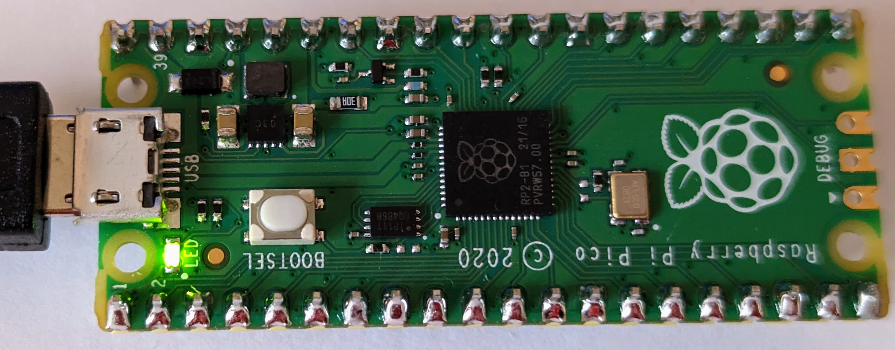
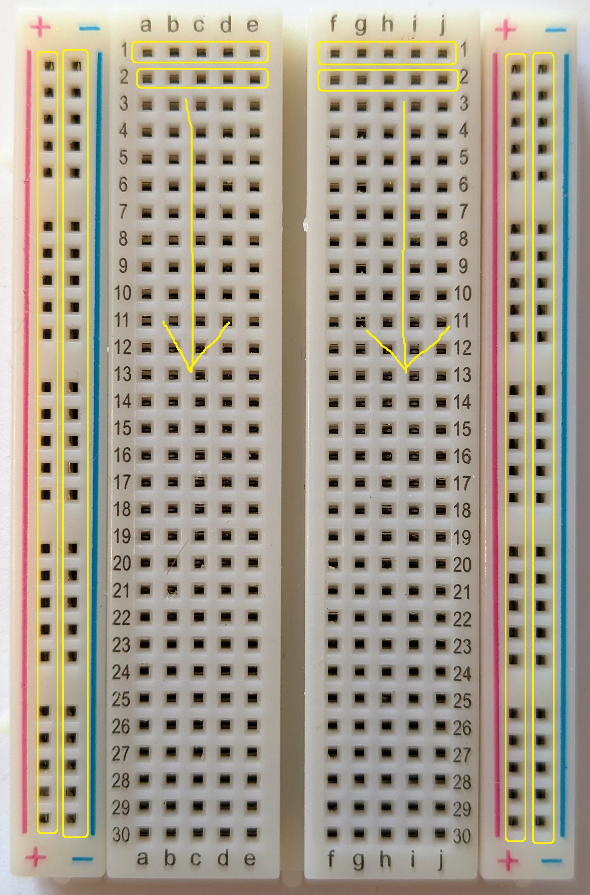
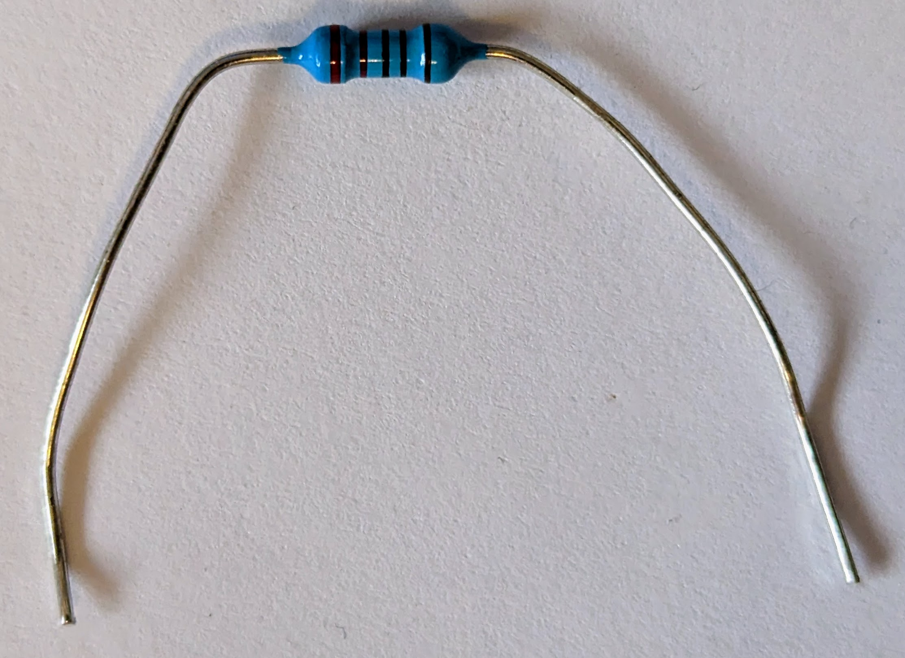

# Lesson #2: Blinky Light
## Introduction to the wiring and programming your Raspberry Pi Pico 

#### What you will need:
 - Raspberry Pi Pico
 - Breadboard
 - 4 Wires
 - 3 Resistors
 - 3 LEDs

#### Objectives
 - Make the onboard LED blink
 - Connect the Pico to three LEDs via a breadboard
 - Blink the three LEDs in sequence
 - Get creative with your code

## Step 1: Get familiar with the Raspberry Pi Pico

This is the top of the Pico.  Notice the small LED in the top right corner of the board and the micorUSB connector on the right side.  The first part of this lesson will blink the small LED.  


This is the bottom of the Pico.  Notice that all of the pins are labeled.  We will connect LEDs to pins GP11, GP12, GP13 later in the lesson.  There are also multiple GND (a.k.a., "Ground") pins on the board and we will be using one of them as well.


## Step 2: Blink the onboard LED

The onboard LED is mapped to pin 25 on the Raspberry Pi Pico.  The following code will blink the onboard LED.  Take some time to read the comments in this code so you understand what is happening, this will help you later in the lesson.  In python, comments are marked with an '#'.

```python
from machine import Pin  #This imports the libraries needed for us to access the Pico and it's pins
import time #The time library will enable us to use the sleep method

#The next few lines creates and initializes a variable "led" as type "Pin" with initialization parameters.  It can also be written in one line like this... led = Pin(25, Pin.OUT)
led = Pin( #Initialize a variable called "led" as a "Pin" object
    25, #Assign pin number 25 (which is the onboard led)
    Pin.OUT) #Specify this is an output pin, meaning we will send data to the pin vs recieving data from it

while True: #A while loop will run until the argument is no longer true.  In this case, True will always be true so it will run forever until we forcefully stop the program
    led.toggle() #Call the "toggle()" function of the led object
    time.sleep(1) #Call the sleep() function of the time object and pass it "1" so it sleeps for 1 second
```

Load and run [BlinkOnboardLEDwithLoop.py](code/BlinkOnboardLEDwithLoop.py) on the Pi and the onboard LED should blink.

Below is a picture of the LED when it is on, it isn't very bright.


## Step 3: Wire the Breadboard

Next we will connect the Pi to a breadboard and wire an LED to one of its pins.

Below is an image of a breadboard, let's get oriented with how it works.  Notice there are a number of rows, marked with numbers and two sets of columns, one marked with letters and another with a + (plus) an - (minus) sign.  Also notice there is a central lane separating the two halves of the breadboard.  

All of the holes in the column with a + (plus) sign are connected and all of the holes in the column with the - (minus) sign are connected.  This allows us to provide power or ground to any pin/device.  The middle matrix of rows/columns marked with numbers/letters are connected differently.  Each numbered row on each side of the center lane is connected as well.


Next you should insert the Raspberry Pi into the breadboard as in the image below.  Make sure the Pi straddles the center lane so that each pin in connected indepentedly.  If you were to connect all of the pins on the same side of the board, the Pi would be damaged/destroyed since pins would be connected to each other.  

Be gentle with the Pi so you don't bend/break it as you insert it into the breadboard, but it may be VERY difficult to get it to seat fully.  Ask for some help if you need it, but you need to ensure the Pi is fully seated into the breadboard.


Next, let's wire an LED to the Pi using the breadboard.  You will need a single LED and a resistor, let's learn about both of them first.  

Below is an LED (Light Emitting Diode).  Notice that one leg of the LED is longer than the other.  The longer leg is the positive (+) side and the shorter leg is the negative (-) side.  This is important to remember.  Wiring the LED backward wil not allow it to light up (and could destroy it).


You will also need a resistor, which is pictured below.  The more resistance provided by the resistor, the less current is allowed to flow to the LED.  More current means a brighter light, less current means a dimmer light.  If you were to skip the resistor (or use one with too little resistance), you will damage both the LED and the Pi because the LED would get more current than it can handle and the Pi would be sending more current than it can support through that pin.  The resistor is important to protect the circut from overloading.  

Notice the colored bands markings on the resistor, these indicate the amount of resistance that will be provided.  It is admittedly a pretty cryptic system, but resistors are small so it is what it is.  You can decode the bands using online resitor color code calculators, like .  For our needs we will use a resistor that is between 220 and 330 Ohms.  The resistor pictured below is 330 Ohms and has band colors Orange, Orange, Black, Black, Brown.


