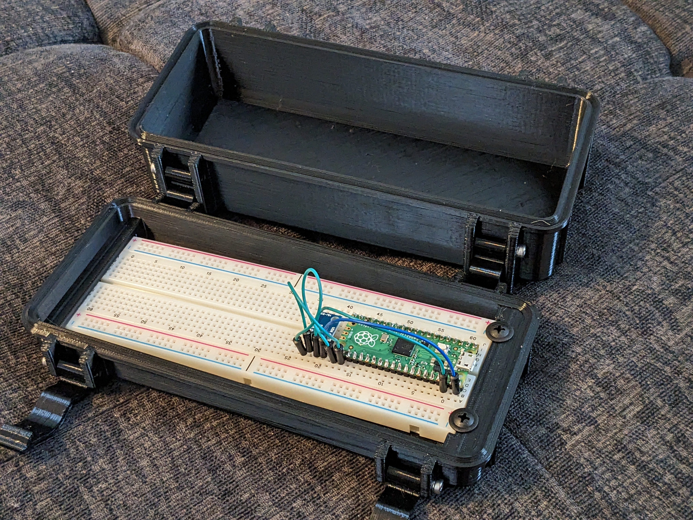
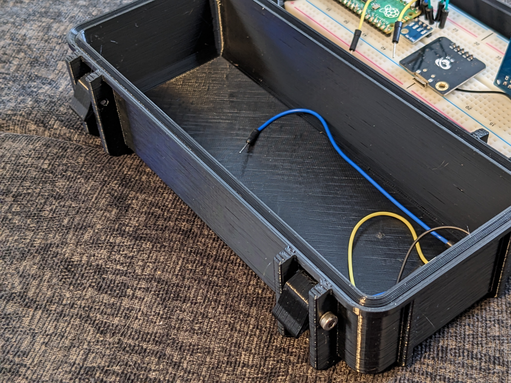
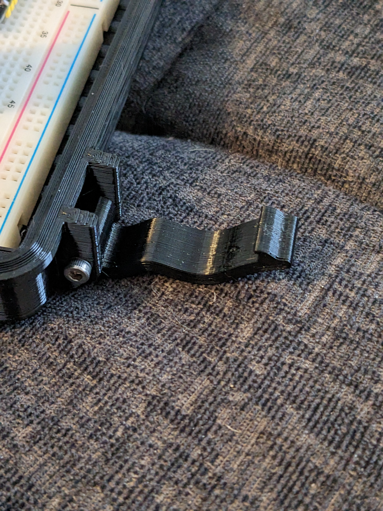
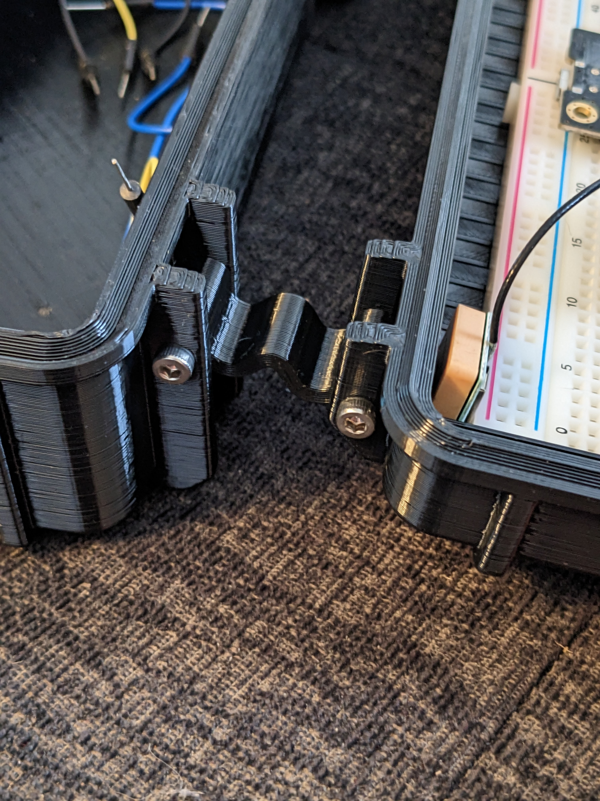

Remixed off the Frog Box by Nibb31: https://www.thingiverse.com/thing:4094861  

We adjusted the size for our needs and added the ability to hold a breadboard in the lid for safe storage of the student project and parts.

Parts required to assemble:  
* 8 [M3 x 20mm screws](https://www.amazon.com/M3-0-5-Button-Socket-Screws-Quantity/dp/B083HR5HZ9)  

Parts required to hold breadboard:
* 2 [3mm washers](https://www.amazon.com/uxcell-Plated-Washers-Gaskets-Spacers/dp/B01N99WRP8) plus 2 more of the above screws  
or
* 2 [#8 1/2" Truss Head wood screws](https://www.amazon.com/Black-Phillips-Modified-Screws-BCP1077/dp/B08545BSYB)  
    or  
* 2 [M3 x 10mm - 20mm flanged head screws](https://www.amazon.com/M3-0-5-Flanged-Button-Stainless-Quantity/dp/B09ZH4KL53)  

The truss head screws have a larger flange making them the best option, but the other options will work.

Print one each of:  
* Frog Box Lid Pico Screw.stl
* Frog Box no seal.stl

Print two each of:
* hinge_looser.stl
* latch_arm_v2.stl
* latch_cam_v2.stl

Assemble as shown. Simply snug tighten each screw, do not overtighten or it'll strip out the plastic and no longer hold. Ensure the pico usb connection is on the end shown, so it can be plugged in when the box is open. 

Orient the cam so the longer side is away from the other part of the box. 

Orientation of the Latch Arm.

Orientation of the hinge.

